# library (media toolkit)

A wise philosopher once told me: "the future is [autotainment](https://www.youtube.com/watch?v=F9sZFrsjPp0)".

Manage and curate large media libraries. An index for your archive.
Primary usage is local filesystem but also supports some virtual constructs like
tracking online video playlists (eg. YouTube subscriptions) and scheduling browser tabs.

## Install

Linux recommended but [Windows setup instructions](./Windows.md) available.

    pip install xklb

Should also work on Mac OS.

### External dependencies

Required: `ffmpeg`

Some features work better with: `mpv`, `firefox`, `fish`

## Getting started

<details><summary>Local media</summary>

### 1. Extract Metadata

For thirty terabytes of video the initial scan takes about four hours to complete.
After that, subsequent scans of the path (or any subpaths) are much quicker--only
new files will be read by `ffprobe`.

    library fsadd tv.db ./video/folder/



### 2. Watch / Listen from local files

    library watch tv.db                           # the default post-action is to do nothing
    library watch tv.db --post-action delete      # delete file after playing
    library listen finalists.db -k ask_keep       # ask whether to keep file after playing

To stop playing press Ctrl+C in either the terminal or mpv

</details>

<details><summary>Online media</summary>

### 1. Download Metadata

Download playlist and channel metadata. Break free of the YouTube algo~

    library tubeadd educational.db https://www.youtube.com/c/BranchEducation/videos

[](https://asciinema.org/a/BzplqNj9sCERH3A80GVvwsTTT)

And you can always add more later--even from different websites.

    library tubeadd maker.db https://vimeo.com/terburg

To prevent mistakes the default configuration is to download metadata for only
the most recent 20,000 videos per playlist/channel.

    library tubeadd maker.db --extractor-config playlistend=1000

Be aware that there are some YouTube Channels which have many items--for example
the TEDx channel has about 180,000 videos. Some channels even have upwards of
two million videos. More than you could likely watch in one sitting--maybe even one lifetime.
On a high-speed connection (>500 Mbps), it can take up to five hours to download
the metadata for 180,000 videos.

TIP! If you often copy and paste many URLs you can paste line-delimited text as arguments via a subshell. For example, in `fish` shell with [cb](https://github.com/niedzielski/cb):

    library tubeadd my.db (cb)

Or in BASH:

    library tubeadd my.db $(xclip -selection c)

#### 1a. Get new videos for saved playlists

Tubeupdate will go through the list of added playlists and fetch metadata for
any videos not previously seen.

    library tubeupdate tube.db

### 2. Watch / Listen from websites

    library watch maker.db

To stop playing press Ctrl+C in either the terminal or mpv

</details>

<details><summary>List all subcommands</summary>

    $ library
    xk media library subcommands (v2.2.162)

    local media:
      lb fsadd                 Create a local media database; Add folders
      lb fsupdate              Refresh database: add new files, mark deleted

      lb listen                Listen to local and online media
      lb watch                 Watch local and online media
      lb search                Search text and subtitles

      lb read                  Read books
      lb view                  View images

      lb bigdirs               Discover folders which take much room
      lb dedupe                Deduplicate a media db's media files
      lb czkawka-dedupe        Split-screen czkawka results to decide which to delete
      lb relmv                 Move files/folders while preserving relative paths
      lb christen              Cleanse files by giving them a new name

      lb mv-list               Reach a target free space by moving data across mount points
      lb scatter               Scatter files across multiple mountpoints (mergerfs balance)

      lb search-db             Search a SQLITE file
      lb merge-dbs             Merge multiple SQLITE files
      lb dedupe-dbs            Deduplicate SQLITE tables
      lb copy-play-counts      Copy play counts from multiple SQLITE files

    online media:
      lb tubeadd               Create a tube database; Add playlists
      lb tubeupdate            Fetch new videos from saved playlists

      lb galleryadd            Create a gallery database; Add albums
      lb galleryupdate         Fetch new images from saved playlists

      lb redditadd             Create a reddit database; Add subreddits
      lb redditupdate          Fetch new posts from saved subreddits

      lb tildes                Backup tildes comments and topics
      lb substack              Backup substack articles

      lb merge-online-local    Merge local and online metadata

    downloads:
      lb download              Download media
      lb redownload            Redownload missing media
      lb block                 Prevent downloading specific media

    playback:
      lb now                   Print what is currently playing
      lb next                  Play next file
      lb stop                  Stop all playback
      lb pause                 Pause all playback

    statistics:
      lb history               Show some playback statistics
      lb playlists             List added playlists
      lb download-status       Show download status
      lb disk-usage            Print disk usage
      lb mount-stats           Print mount usage

    browser tabs:
      lb tabsadd               Create a tabs database; Add URLs
      lb tabs                  Open your tabs for the day
      lb siteadd               Create a sites database; Add URLs
      lb surf                  Load browser tabs in a streaming way (stdin)

    places:
      lb places-import         Load POIs from Google Maps Google Takeout

    mining:
      lb eda                   Exploratory Data Analysis on table-like files
      lb mcda                  Multi-criteria ranking on table-like files
      lb incremental-diff      Diff large table-like files in chunks

      lb reddit-selftext       db selftext external links -> db media table
      lb pushshift             Convert Pushshift jsonl.zstd -> reddit.db format (stdin)
      lb hnadd                 Create a hackernews database (this takes a few days)

      lb extract-links         Extract inner links from lists of web pages
      lb markdown-links        Extract titles from lists of web pages

      lb mpv-watchlater        Import timestamps from mpv watchlater to history table

      lb cluster-sort          Lines -> sorted by sentence similarity groups (stdin)
      lb nouns                 Unstructured text -> compound nouns (stdin)
    

</details>

## Examples

### Watch online media on your PC

    wget https://github.com/chapmanjacobd/library/raw/main/example_dbs/mealtime.tw.db
    library watch mealtime.tw.db --random --duration 30m

### Listen to online media on a chromecast group

    wget https://github.com/chapmanjacobd/library/raw/main/example_dbs/music.tl.db
    library listen music.tl.db -ct "House speakers" --random

### Hook into HackerNews

    wget https://github.com/chapmanjacobd/hn_mining/raw/main/hackernews_only_direct.tw.db
    library watch hackernews_only_direct.tw.db --random --ignore-errors

### Organize via separate databases

    library fsadd --audio both.db ./audiobooks/ ./podcasts/
    library fsadd --audio audiobooks.db ./audiobooks/
    library fsadd --audio podcasts.db ./podcasts/ ./another/more/secret/podcasts_folder/

## Guides

### Music alarm clock

<details><summary>via termux crontab</summary>

Wake up to your own music

    30 7 * * * library listen ./audio.db

Wake up to your own music _only when you are *not* home_ (computer on local IP)

    30 7 * * * timeout 0.4 nc -z 192.168.1.12 22 || library listen --random

Wake up to your own music on your Chromecast speaker group _only when you are home_

    30 7 * * * ssh 192.168.1.12 library listen --cast --cast-to "Bedroom pair"

</details>


### Browser Tabs

<details><summary>Visit websites on a schedule</summary>

`tabs` is a way to organize your visits to URLs that you want to remember every once in a while.

The main benefit of tabs is that you can have a large amount of tabs saved (say 500 monthly tabs) and only the smallest
amount of tabs to satisfy that goal (500/30) tabs will open each day. 17 tabs per day seems manageable--500 all at once does not.

The use-case of tabs are websites that you know are going to change: subreddits, games,
or tools that you want to use for a few minutes daily, weekly, monthly, quarterly, or yearly.

### 1. Add your websites

    library tabsadd tabs.db --frequency monthly --category fun \
        https://old.reddit.com/r/Showerthoughts/top/?sort=top&t=month \
        https://old.reddit.com/r/RedditDayOf/top/?sort=top&t=month

### 2. Add library tabs to cron

library tabs is meant to run **once per day**. Here is how you would configure it with `crontab`:

    45 9 * * * DISPLAY=:0 library tabs /home/my/tabs.db

Or with `systemd`:

    tee ~/.config/systemd/user/tabs.service
    [Unit]
    Description=xklb daily browser tabs

    [Service]
    Type=simple
    RemainAfterExit=no
    Environment="DISPLAY=:0"
    ExecStart="/usr/bin/fish" "-c" "lb tabs /home/xk/lb/tabs.db"

    tee ~/.config/systemd/user/tabs.timer
    [Unit]
    Description=xklb daily browser tabs timer

    [Timer]
    Persistent=yes
    OnCalendar=*-*-* 9:58

    [Install]
    WantedBy=timers.target

    systemctl --user daemon-reload
    systemctl --user enable --now tabs.service

You can also invoke tabs manually:

    library tabs tabs.db -L 1  # open one tab

Incremental surfing. 📈🏄 totally rad!

</details>

### Find large folders

<details><summary>Curate with library big-dirs</summary>

If you are looking for candidate folders for curation (ie. you need space but don't want to buy another hard drive).
The big-dirs subcommand was written for that purpose:

    $ library big-dirs fs/d.db

You may filter by folder depth (similar to QDirStat or WizTree)

    $ library big-dirs --depth=3 audio.db

There is also an flag to prioritize folders which have many files which have been deleted (for example you delete songs you don't like--now you can see who wrote those songs and delete all their other songs...)

    $ library big-dirs --sort-by deleted audio.db

Recently, this functionality has also been integrated into watch/listen subcommands so you could just do this:

    $ library watch --big-dirs ./my.db
    $ lb wt -B  # shorthand equivalent

</details>

### Backfill data

<details><summary>Backfill missing YouTube videos from the Internet Archive</summary>

```fish
for base in https://youtu.be/ http://youtu.be/ http://youtube.com/watch?v= https://youtube.com/watch?v= https://m.youtube.com/watch?v= http://www.youtube.com/watch?v= https://www.youtube.com/watch?v=
    sqlite3 video.db "
        update or ignore media
            set path = replace(path, '$base', 'https://web.archive.org/web/2oe_/http://wayback-fakeurl.archive.org/yt/')
              , time_deleted = 0
        where time_deleted > 0
        and (path = webpath or path not in (select webpath from media))
        and path like '$base%'
    "
end
```

</details>

<details><summary>Backfill reddit databases with pushshift data</summary>

[https://github.com/chapmanjacobd/reddit_mining/](https://github.com/chapmanjacobd/reddit_mining/)

```fish
for reddit_db in ~/lb/reddit/*.db
    set subreddits (sqlite-utils $reddit_db 'select path from playlists' --tsv --no-headers | grep old.reddit.com | sed 's|https://old.reddit.com/r/\(.*\)/|\1|' | sed 's|https://old.reddit.com/user/\(.*\)/|u_\1|' | tr -d "\r")

    ~/github/xk/reddit_mining/links/
    for subreddit in $subreddits
        if not test -e "$subreddit.csv"
            echo "octosql -o csv \"select path,score,'https://old.reddit.com/r/$subreddit/' as playlist_path from `../reddit_links.parquet` where lower(playlist_path) = '$subreddit' order by score desc \" > $subreddit.csv"
        end
    end | parallel -j8

    for subreddit in $subreddits
        sqlite-utils upsert --pk path --alter --csv --detect-types $reddit_db media $subreddit.csv
    end

    library tubeadd --safe --ignore-errors --force $reddit_db (sqlite-utils --raw-lines $reddit_db 'select path from media')
end
```

</details>

### Datasette

<details><summary>Explore `library` databases in your browser</summary>

    pip install datasette
    datasette tv.db

</details>

### Pipe to [mnamer](https://github.com/jkwill87/mnamer)

<details><summary>Rename poorly named files</summary>

    pip install mnamer
    mnamer --movie-directory ~/d/70_Now_Watching/ --episode-directory ~/d/70_Now_Watching/ \
        --no-overwrite -b (library watch -p fd -s 'path : McCloud')
    library fsadd ~/d/70_Now_Watching/

</details>

### Pipe to [lowcharts](https://github.com/juan-leon/lowcharts)

<details><summary>$ library watch -p f -col time_created | lowcharts timehist -w 80</summary>

    Matches: 445183.
    Each ∎ represents a count of 1896
    [2022-04-13 03:16:05] [151689] ∎∎∎∎∎∎∎∎∎∎∎∎∎∎∎∎∎∎∎∎∎∎∎∎∎∎∎∎∎∎∎∎∎∎∎∎∎∎∎∎∎∎∎∎∎∎∎∎∎∎∎∎∎∎∎∎∎∎∎∎∎∎∎∎∎∎∎∎∎∎∎∎∎∎∎∎∎∎∎∎
    [2022-04-19 07:59:37] [ 16093] ∎∎∎∎∎∎∎∎
    [2022-04-25 12:43:09] [ 12019] ∎∎∎∎∎∎
    [2022-05-01 17:26:41] [ 48817] ∎∎∎∎∎∎∎∎∎∎∎∎∎∎∎∎∎∎∎∎∎∎∎∎∎
    [2022-05-07 22:10:14] [ 36259] ∎∎∎∎∎∎∎∎∎∎∎∎∎∎∎∎∎∎∎
    [2022-05-14 02:53:46] [  3942] ∎∎
    [2022-05-20 07:37:18] [  2371] ∎
    [2022-05-26 12:20:50] [   517]
    [2022-06-01 17:04:23] [  4845] ∎∎
    [2022-06-07 21:47:55] [  2340] ∎
    [2022-06-14 02:31:27] [   563]
    [2022-06-20 07:14:59] [ 13836] ∎∎∎∎∎∎∎
    [2022-06-26 11:58:32] [  1905] ∎
    [2022-07-02 16:42:04] [  1269]
    [2022-07-08 21:25:36] [  3062] ∎
    [2022-07-15 02:09:08] [  9192] ∎∎∎∎
    [2022-07-21 06:52:41] [ 11955] ∎∎∎∎∎∎
    [2022-07-27 11:36:13] [ 50938] ∎∎∎∎∎∎∎∎∎∎∎∎∎∎∎∎∎∎∎∎∎∎∎∎∎∎
    [2022-08-02 16:19:45] [ 70973] ∎∎∎∎∎∎∎∎∎∎∎∎∎∎∎∎∎∎∎∎∎∎∎∎∎∎∎∎∎∎∎∎∎∎∎∎∎
    [2022-08-08 21:03:17] [  2598] ∎

BTW, for some cols like time_deleted you'll need to specify a where clause so they aren't filtered out:

    $ library watch -p f -col time_deleted -w time_deleted'>'0 | lowcharts timehist -w 80


</details>

## Usage


### Create database subcommands

<details><summary>Add local media (fsadd)</summary>

    $ library fsadd -h
    usage: library fsadd [(--video) | --audio | --image |  --text | --filesystem] DATABASE PATH ...

    The default database type is video:
        library fsadd tv.db ./tv/
        library fsadd --video tv.db ./tv/  # equivalent

    You can also create audio databases. Both audio and video use ffmpeg to read metadata:
        library fsadd --audio audio.db ./music/

    Image uses ExifTool:
        library fsadd --image image.db ./photos/

    Text will try to read files and save the contents into a searchable database:
        library fsadd --text text.db ./documents_and_books/

    Create a text database and scan with OCR and speech-recognition:
        library fsadd --text --ocr --speech-recognition ocr.db ./receipts_and_messages/

    Create a video database and read internal/external subtitle files into a searchable database:
        library fsadd --scan-subtitles tv.search.db ./tv/ ./movies/

    Decode media to check for corruption (slow):
        library fsadd --check-corrupt 100 tv.db ./tv/  # scan through 100 percent of each file to evaluate how corrupt it is (very slow)
        library fsadd --check-corrupt   1 tv.db ./tv/  # scan through 1 percent of each file to evaluate how corrupt it is (takes about one second per file)
        library fsadd --check-corrupt   5 tv.db ./tv/  # scan through 5 percent of each file to evaluate how corrupt it is (takes about ten seconds per file)

        library fsadd --check-corrupt   5 --delete-corrupt 30 tv.db ./tv/  # scan 5 percent of each file to evaluate how corrupt it is, if 30 percent or more of those checks fail then the file is deleted

        nb: the behavior of delete-corrupt changes between full and partial scan
        library fsadd --check-corrupt  99 --delete-corrupt  1 tv.db ./tv/  # partial scan 99 percent of each file to evaluate how corrupt it is, if 1 percent or more of those checks fail then the file is deleted
        library fsadd --check-corrupt 100 --delete-corrupt  1 tv.db ./tv/  # full scan each file to evaluate how corrupt it is, if there is _any_ corruption then the file is deleted

    Normally only relevant filetypes are included. You can scan all files with this flag:
        library fsadd --scan-all-files mixed.db ./tv-and-maybe-audio-only-files/
        # I use that with this to keep my folders organized:
        library watch -w 'video_count=0 and audio_count>=1' -pf mixed.db | parallel mv {} ~/d/82_Audiobooks/

    Remove path roots with --force
        library fsadd audio.db /mnt/d/Youtube/
        [/mnt/d/Youtube] Path does not exist

        library fsadd --force audio.db /mnt/d/Youtube/
        [/mnt/d/Youtube] Path does not exist
        [/mnt/d/Youtube] Building file list...
        [/mnt/d/Youtube] Marking 28932 orphaned metadata records as deleted


</details>

<details><summary>Add online video media (yt-dlp) (tubeadd)</summary>

    $ library tubeadd -h
    usage: library tubeadd [--safe] [--extra] [--subs] [--auto-subs] DATABASE URLS ...

    Create a dl database / add links to an existing database

        library tubeadd dl.db https://www.youdl.com/c/BranchEducation/videos

    Add links from a line-delimited file

        cat ./my_yt_subscriptions.txt | library tubeadd reddit.db -

    Add metadata to links already in a database table

        library tubeadd --force reddit.db (sqlite-utils --raw-lines reddit.db 'select path from media')

    Fetch extra metadata:

        By default tubeadd will quickly add media at the expense of less metadata.
        If you plan on using `library download` then it doesn't make sense to use `--extra`.
        Downloading will add the extra metadata automatically to the database.
        You can always fetch more metadata later via tubeupdate:
        library tubeupdate tw.db --extra


</details>

<details><summary>Add online gallery media (gallery-dl) (galleryadd)</summary>

    $ library galleryadd -h
    usage: library galleryadd DATABASE URLS

    Add gallery_dl URLs to download later or periodically update

    If you have many URLs use stdin

        cat ./my-favorite-manhwa.txt | library galleryadd my.db --insert-only -


</details>

<details><summary>Add browser tabs (tabsadd)</summary>

    $ library tabsadd -h
    usage: library tabsadd [--frequency daily weekly (monthly) quarterly yearly] [--no-sanitize] DATABASE URLS ...

    Adding one URL:

        library tabsadd -f daily tabs.db https://wiby.me/surprise/

        Depending on your shell you may need to escape the URL (add quotes)

        If you use Fish shell know that you can enable features to make pasting easier:
            set -U fish_features stderr-nocaret qmark-noglob regex-easyesc ampersand-nobg-in-token

        Also I recommend turning Ctrl+Backspace into a super-backspace for repeating similar commands with long args:
            echo 'bind \b backward-kill-bigword' >> ~/.config/fish/config.fish

    Importing from a line-delimitated file:

        library tabsadd -f yearly -c reddit tabs.db (cat ~/mc/yearly-subreddit.cron)


</details>

<details><summary>Auto-scrape website data to SQLITE (siteadd)</summary>

    $ library siteadd -h
    usage: library site-add DATABASE PATH ... [--auto-pager] [--poke] [--local-html] [--file FILE]

    Extract data from website requests to a database

        library siteadd jobs.st.db --poke https://hk.jobsdb.com/hk/search-jobs/python/

    Run with `-vv` to see and interact with the browser


</details>

<details><summary>Add reddit media (redditadd)</summary>

    $ library redditadd -h
    usage: library redditadd [--lookback N_DAYS] [--praw-site bot1] DATABASE URLS ...

    Fetch data for redditors and reddits:

        library redditadd interesting.db https://old.reddit.com/r/coolgithubprojects/ https://old.reddit.com/user/Diastro

    If you have a file with a list of subreddits you can do this:

        library redditadd 96_Weird_History.db --subreddits (cat ~/mc/96_Weird_History-reddit.txt)

    Likewise for redditors:

        library redditadd shadow_banned.db --redditors (cat ~/mc/shadow_banned.txt)

    Note that reddit's API is limited to 1000 posts and it usually doesn't go back very far historically.
    Also, it may be the case that reddit's API (praw) will stop working in the near future. For both of these problems
    my suggestion is to use pushshift data.
    You can find more info here: https://github.com/chapmanjacobd/reddit_mining#how-was-this-made


</details>

<details><summary>Convert pushshift data to reddit.db format</summary>

    $ library pushshift -h
    usage: library pushshift DATABASE < stdin

    Download data (about 600GB jsonl.zst; 6TB uncompressed)

        wget -e robots=off -r -k -A zst https://files.pushshift.io/reddit/submissions/

    Load data from files via unzstd

        unzstd --memory=2048MB --stdout RS_2005-07.zst | library pushshift pushshift.db

    Or multiple (output is about 1.5TB SQLITE fts-searchable):

        for f in psaw/files.pushshift.io/reddit/submissions/*.zst
            echo "unzstd --memory=2048MB --stdout $f | library pushshift (basename $f).db"
            library optimize (basename $f).db
        end | parallel -j5


</details>

<details><summary>Create / Update a Hacker News database (hnadd)</summary>

    $ library hnadd -h
    usage: library hnadd [--oldest] DATABASE

    Fetch latest stories first:

        library hnadd hn.db -v
        Fetching 154873 items (33212696 to 33367569)
        Saving comment 33367568
        Saving comment 33367543
        Saving comment 33367564
        ...

    Fetch oldest stories first:

        library hnadd --oldest hn.db


</details>

<details><summary>Backup substack articles</summary>

    $ library substack -h
    usage: library substack DATABASE PATH ...

    Backup substack articles


</details>

<details><summary>Backup tildes comments and topics</summary>

    $ library tildes -h
    usage: library tildes DATABASE USER

    Backup tildes.net user comments and topics

        library tildes tildes.net.db xk3

    Without cookies you are limited to the first page. You can use cookies like this:
        https://github.com/rotemdan/ExportCookies
        library tildes tildes.net.db xk3 --cookies ~/Downloads/cookies-tildes-net.txt


</details>

<details><summary>Import places of interest (POIs) (places-import)</summary>

    $ library places-import -h
    usage: library places-import DATABASE PATH ...

    Load POIs from Google Maps Google Takeout


</details>

### Update database subcommands

<details><summary>Update local media (fsupdate)</summary>

    $ library fsupdate -h
    usage: library fsupdate DATABASE

    Update each path previously saved:

        library fsupdate video.db


</details>

<details><summary>Update online video media (tubeupdate)</summary>

    $ library tubeupdate -h
    usage: library tubeupdate [--audio | --video] DATABASE

    Fetch the latest videos for every playlist saved in your database

        library tubeupdate educational.db

    Fetch extra metadata:

        By default tubeupdate will quickly add media.
        You can run with --extra to fetch more details: (best resolution width, height, subtitle tags, etc)

        library tubeupdate educational.db --extra https://www.youtube.com/channel/UCBsEUcR-ezAuxB2WlfeENvA/videos

    Remove duplicate playlists:

        lb dedupe-db video.db playlists --bk extractor_playlist_id


</details>

<details><summary>Update online gallery media (galleryupdate)</summary>

    $ library galleryupdate -h
    usage: library galleryupdate DATABASE URLS

    Check previously saved gallery_dl URLs for new content


</details>

<details><summary>Update reddit media (redditupdate)</summary>

    $ library redditupdate -h
    usage: library redditupdate [--audio | --video] [--lookback N_DAYS] [--praw-site bot1] DATABASE

    Fetch the latest posts for every subreddit/redditor saved in your database

        library redditupdate edu_subreddits.db


</details>

### Media database subcommands

<details><summary>Watch / Listen</summary>

    $ library watch -h
    usage: library watch DATABASE [optional args]

    Control playback:
        To stop playback press Ctrl-C in either the terminal or mpv

        Create global shortcuts in your desktop environment by sending commands to mpv_socket:
        echo 'playlist-next force' | socat - /tmp/mpv_socket

    Override the default player (mpv):
        library does a lot of things to try to automatically use your preferred media player
        but if it doesn't guess right you can make it explicit:
        library watch --player "vlc --vlc-opts"

    Cast to chromecast groups:
        library watch --cast --cast-to "Office pair"
        library watch -ct "Office pair"  # equivalent
        If you don't know the exact name of your chromecast group run `catt scan`

    Play media in order (similarly named episodes):
        library watch --play-in-order
        There are multiple strictness levels of --play-in-order:
        library watch -O    # equivalent
        library watch -OO   # above, plus ignores most filters
        library watch -OOO  # above, plus ignores fts and (include/exclude) filter during ordinal search
        library watch -OOOO # above, plus starts search with parent folder

        If searching by a specific subpath it may be preferable to just sort by path instead
        library watch d/planet.earth.2024/ -u path

        library watch --related  # Similar to -O but uses fts to find similar content
        library watch -R         # equivalent
        library watch -RR        # above, plus ignores most filters

        library watch --cluster  # cluster-sort to put similar-named paths closer together
        library watch -C         # equivalent

        library watch --big-dirs # Recommended to use with --duration or --depth filters; see `lb big-dirs -h` for more info
        library watch -B         # equivalent

        All of these options can be used together but it will be a bit slow and the results might be mid-tier
        as multiple different algorithms create a muddied signal (too many cooks in the kitchen):
        library watch -RRCOO

        You can even sort the items within each cluster by auto-MCDA ~LOL~
        library watch -B --sort-by 'mcda median_size,-deleted'
        library watch -C --sort-by 'mcda median_size,-deleted'

    Filter media by file siblings of parent directory:
        library watch --sibling   # only include files which have more than or equal to one sibling
        library watch --solo      # only include files which are alone by themselves

        `--sibling` is just a shortcut for `--lower 2`; `--solo` is `--upper 1`
        library watch --sibling --solo      # you will always get zero records here
        library watch --lower 2 --upper 1   # equivalent

        You can be more specific via the `--upper` and `--lower` flags
        library watch --lower 3   # only include files which have three or more siblings
        library watch --upper 3   # only include files which have fewer than three siblings
        library watch --lower 3 --upper 3   # only include files which are three siblings inclusive
        library watch --lower 12 --upper 25 -OOO  # on my machine this launches My Mister 2018

    Play recent partially-watched videos (requires mpv history):
        library watch --partial       # play newest first

        library watch --partial old   # play oldest first
        library watch -P o            # equivalent

        library watch -P p            # sort by percent remaining
        library watch -P t            # sort by time remaining
        library watch -P s            # skip partially watched (only show unseen)

        The default time used is "last-viewed" (ie. the most recent time you closed the video)
        If you want to use the "first-viewed" time (ie. the very first time you opened the video)
        library watch -P f            # use watch_later file creation time instead of modified time

        You can combine most of these options, though some will be overridden by others.
        library watch -P fo           # this means "show the oldest videos using the time I first opened them"
        library watch -P pt           # weighted remaining (percent * time remaining)

    Print instead of play:
        library watch --print --limit 10  # print the next 10 files
        library watch -p -L 10  # print the next 10 files
        library watch -p  # this will print _all_ the media. be cautious about `-p` on an unfiltered set

        Printing modes
        library watch -p    # print as a table
        library watch -p a  # print an aggregate report
        library watch -p b  # print a big-dirs report (see library bigdirs -h for more info)
        library watch -p f  # print fields (defaults to path; use --cols to change)
                               # -- useful for piping paths to utilities like xargs or GNU Parallel

        library watch -p d  # mark deleted
        library watch -p w  # mark watched

        Some printing modes can be combined
        library watch -p df  # print files for piping into another program and mark them as deleted within the db
        library watch -p bf  # print fields from big-dirs report

        Check if you have downloaded something before
        library watch -u duration -p -s 'title'

        Print an aggregate report of deleted media
        library watch -w time_deleted!=0 -p=a
        ╒═══════════╤══════════════╤═════════╤═════════╕
        │ path      │ duration     │ size    │   count │
        ╞═══════════╪══════════════╪═════════╪═════════╡
        │ Aggregate │ 14 days, 23  │ 50.6 GB │   29058 │
        │           │ hours and 42 │         │         │
        │           │ minutes      │         │         │
        ╘═══════════╧══════════════╧═════════╧═════════╛
        Total duration: 14 days, 23 hours and 42 minutes

        Print an aggregate report of media that has no duration information (ie. online or corrupt local media)
        library watch -w 'duration is null' -p=a

        Print a list of filenames which have below 1280px resolution
        library watch -w 'width<1280' -p=f

        Print media you have partially viewed with mpv
        library watch --partial -p
        library watch -P -p  # equivalent
        library watch -P -p f --cols path,progress,duration  # print CSV of partially watched files
        library watch --partial -pa  # print an aggregate report of partially watched files

        View how much time you have watched
        library watch -w play_count'>'0 -p=a

        See how much video you have
        library watch video.db -p=a
        ╒═══════════╤═════════╤═════════╤═════════╕
        │ path      │   hours │ size    │   count │
        ╞═══════════╪═════════╪═════════╪═════════╡
        │ Aggregate │  145769 │ 37.6 TB │  439939 │
        ╘═══════════╧═════════╧═════════╧═════════╛
        Total duration: 16 years, 7 months, 19 days, 17 hours and 25 minutes

        View all the columns
        library watch -p -L 1 --cols '*'

        Open ipython with all of your media
        library watch -vv -p --cols '*'
        ipdb> len(media)
        462219

    Set the play queue size:
        By default the play queue is 120--long enough that you likely have not noticed
        but short enough that the program is snappy.

        If you want everything in your play queue you can use the aid of infinity.
        Pick your poison (these all do effectively the same thing):
        library watch -L inf
        library watch -l inf
        library watch --queue inf
        library watch -L 999999999999

        You may also want to restrict the play queue.
        For example, when you only want 1000 random files:
        library watch -u random -L 1000

    Offset the play queue:
        You can also offset the queue. For example if you want to skip one or ten media:
        library watch --skip 10        # offset ten from the top of an ordered query

    Repeat
        library watch                  # listen to 120 random songs (DEFAULT_PLAY_QUEUE)
        library watch --limit 5        # listen to FIVE songs
        library watch -l inf -u random # listen to random songs indefinitely
        library watch -s infinite      # listen to songs from the band infinite

    Constrain media by search:
        Audio files have many tags to readily search through so metadata like artist,
        album, and even mood are included in search.
        Video files have less consistent metadata and so only paths are included in search.
        library watch --include happy  # only matches will be included
        library watch -s happy         # equivalent
        library watch --exclude sad    # matches will be excluded
        library watch -E sad           # equivalent

        Search only the path column
        library watch -O -s 'path : mad max'
        library watch -O -s 'path : "mad max"' # add "quotes" to be more strict

        Double spaces are parsed as one space
        library watch -s '  ost'        # will match OST and not ghost
        library watch -s toy story      # will match '/folder/toy/something/story.mp3'
        library watch -s 'toy  story'   # will match more strictly '/folder/toy story.mp3'

        You can search without -s but it must directly follow the database due to how argparse works
        library watch my.db searching for something

    Constrain media by arbitrary SQL expressions:
        library watch --where audio_count = 2  # media which have two audio tracks
        library watch -w "language = 'eng'"    # media which have an English language tag
                                                    (this could be audio _or_ subtitle)
        library watch -w subtitle_count=0      # media that doesn't have subtitles

    Constrain media to duration (in minutes):
        library watch --duration 20
        library watch -d 6  # 6 mins ±10 percent (ie. between 5 and 7 mins)
        library watch -d-6  # less than 6 mins
        library watch -d+6  # more than 6 mins

        Duration can be specified multiple times:
        library watch -d+5 -d-7  # should be similar to -d 6

        If you want exact time use `where`
        library watch --where 'duration=6*60'

    Constrain media to file size (in megabytes):
        library watch --size 20
        library watch -S 6  # 6 MB ±10 percent (ie. between 5 and 7 MB)
        library watch -S-6  # less than 6 MB
        library watch -S+6  # more than 6 MB

    Constrain media by time_created / time_last_played / time_deleted / time_modified:
        library watch --created-within '3 days'
        library watch --created-before '3 years'

    Constrain media by throughput:
        Bitrate information is not explicitly saved.
        You can use file size and duration as a proxy for throughput:
        library watch -w 'size/duration<50000'

    Constrain media to portrait orientation video:
        library watch --portrait
        library watch -w 'width<height' # equivalent

    Constrain media to duration of videos which match any size constraints:
        library watch --duration-from-size +700 -u 'duration desc, size desc'

    Constrain media to online-media or local-media:
        Not to be confused with only local-media which is not "offline" (ie. one HDD disconnected)
        library watch --online-media-only
        library watch --online-media-only -i  # and ignore playback errors (ie. YouTube video deleted)
        library watch --local-media-only

    Specify media play order:
        library watch --sort duration   # play shortest media first
        library watch -u duration desc  # play longest media first

        You can use multiple SQL ORDER BY expressions
        library watch -u 'subtitle_count > 0 desc' # play media that has at least one subtitle first

        Prioritize large-sized media
        library watch --sort 'ntile(10000) over (order by size/duration) desc'
        library watch -u 'ntile(100) over (order by size) desc'

        Sort by count of media with the same-X column (default DESC: most common to least common value)
        library watch -u same-duration
        library watch -u same-title
        library watch -u same-size
        library watch -u same-width, same-height ASC, same-fps
        library watch -u same-time_uploaded same-view_count same-upvote_ratio

        No media found when using --random
        In addition to -u/--sort random, there is also the -r/--random flag.
        If you have a large database it should be faster than -u random but it comes with a caveat:
        This flag randomizes via rowid at an earlier stage to boost performance.
        It is possible that you see "No media found" or a smaller amount of media than correct.
        You can bypass this by setting --limit. For example:
        library watch -B --folder-size=+12GiB --folder-size=-100GiB -r -pa
        path         count      size  duration                        avg_duration      avg_size
        ---------  -------  --------  ------------------------------  --------------  ----------
        Aggregate    10000  752.5 GB  4 months, 15 days and 10 hours  20 minutes         75.3 MB
        (17 seconds)
        library watch -B --folder-size=+12GiB --folder-size=-100GiB -r -pa -l inf
        path         count     size  duration                                 avg_duration      avg_size
        ---------  -------  -------  ---------------------------------------  --------------  ----------
        Aggregate   140868  10.6 TB  5 years, 2 months, 28 days and 14 hours  20 minutes         75.3 MB
        (30 seconds)

    Post-actions -- choose what to do after playing:
        library watch --post-action keep    # do nothing after playing (default)
        library watch -k delete             # delete file after playing
        library watch -k softdelete         # mark deleted after playing

        library watch -k ask_keep           # ask whether to keep after playing
        library watch -k ask_delete         # ask whether to delete after playing

        library watch -k move               # move to "keep" dir after playing
        library watch -k ask_move           # ask whether to move to "keep" folder
        The default location of the keep folder is ./keep/ (relative to the played media file)
        You can change this by explicitly setting an *absolute* `keep-dir` path:
        library watch -k ask_move --keep-dir /home/my/music/keep/

        library watch -k ask_move_or_delete # ask after each whether to move to "keep" folder or delete

        You can also bind keys in mpv to different exit codes. For example in input.conf:
            ; quit 5

        And if you run something like:
            library watch --cmd5 ~/bin/process_audio.py

        When semicolon is pressed in mpv (it will exit with error code 5) then the applicable player-exit-code command
        will start with the media file as the first argument; in this case `~/bin/process_audio.py $path`.
        The command will be daemonized if library exits before it completes.
        To prevent confusion, post-actions will be skipped if the exit-code is greater than 4.
        Exit-codes 0, 1, 2, 3, and 4: the player-exit-code command will run after post-actions. Be careful of conflicting player-exit-code command and post-action behavior when using these!

    Experimental options:
        Duration to play (in seconds) while changing the channel
        library watch --interdimensional-cable 40
        library watch -4dtv 40

        Playback multiple files at once
        library watch --multiple-playback    # one per display; or two if only one display detected
        library watch --multiple-playback 4  # play four media at once, divide by available screens
        library watch -m 4 --screen-name eDP # play four media at once on specific screen
        library watch -m 4 --loop --crop     # play four cropped videos on a loop
        library watch -m 4 --hstack          # use hstack style


</details>

<details><summary>Open tabs</summary>

    $ library tabs -h
    usage: library tabs DATABASE

    Tabs is meant to run **once per day**. Here is how you would configure it with `crontab`:

        45 9 * * * DISPLAY=:0 library tabs /home/my/tabs.db

    If things aren't working you can use `at` to simulate a similar environment as `cron`

        echo 'fish -c "export DISPLAY=:0 && library tabs /full/path/to/tabs.db"' | at NOW

    You can also invoke tabs manually:

        library tabs -L 1  # open one tab

    Print URLs

        library tabs -w "frequency='yearly'" -p
        ╒════════════════════════════════════════════════════════════════╤═════════════╤══════════════╕
        │ path                                                           │ frequency   │ time_valid   │
        ╞════════════════════════════════════════════════════════════════╪═════════════╪══════════════╡
        │ https://old.reddit.com/r/Autonomia/top/?sort=top&t=year        │ yearly      │ Dec 31 1970  │
        ├────────────────────────────────────────────────────────────────┼─────────────┼──────────────┤
        │ https://old.reddit.com/r/Cyberpunk/top/?sort=top&t=year        │ yearly      │ Dec 31 1970  │
        ├────────────────────────────────────────────────────────────────┼─────────────┼──────────────┤
        │ https://old.reddit.com/r/ExperiencedDevs/top/?sort=top&t=year  │ yearly      │ Dec 31 1970  │

        ...

        ╘════════════════════════════════════════════════════════════════╧═════════════╧══════════════╛

    View how many yearly tabs you have:

        library tabs -w "frequency='yearly'" -p a
        ╒═══════════╤═════════╕
        │ path      │   count │
        ╞═══════════╪═════════╡
        │ Aggregate │     134 │
        ╘═══════════╧═════════╛

    Delete URLs

        library tb -p -s cyber
        ╒═══════════════════════════════════════╤═════════════╤══════════════╕
        │ path                                  │ frequency   │ time_valid   │
        ╞═══════════════════════════════════════╪═════════════╪══════════════╡
        │ https://old.reddit.com/r/cyberDeck/to │ yearly      │ Dec 31 1970  │
        │ p/?sort=top&t=year                    │             │              │
        ├───────────────────────────────────────┼─────────────┼──────────────┤
        │ https://old.reddit.com/r/Cyberpunk/to │ yearly      │ Aug 29 2023  │
        │ p/?sort=top&t=year                    │             │              │
        ├───────────────────────────────────────┼─────────────┼──────────────┤
        │ https://www.reddit.com/r/cyberDeck/   │ yearly      │ Sep 05 2023  │
        ╘═══════════════════════════════════════╧═════════════╧══════════════╛
        library tb -p -w "path='https://www.reddit.com/r/cyberDeck/'" --delete
        Removed 1 metadata records
        library tb -p -s cyber
        ╒═══════════════════════════════════════╤═════════════╤══════════════╕
        │ path                                  │ frequency   │ time_valid   │
        ╞═══════════════════════════════════════╪═════════════╪══════════════╡
        │ https://old.reddit.com/r/cyberDeck/to │ yearly      │ Dec 31 1970  │
        │ p/?sort=top&t=year                    │             │              │
        ├───────────────────────────────────────┼─────────────┼──────────────┤
        │ https://old.reddit.com/r/Cyberpunk/to │ yearly      │ Aug 29 2023  │
        │ p/?sort=top&t=year                    │             │              │
        ╘═══════════════════════════════════════╧═════════════╧══════════════╛


</details>

<details><summary>Block a channel</summary>

    $ library block -h
    usage: library block DATABASE URLS ...

    Blocklist specific URLs (eg. YouTube channels, etc)

        library block dl.db https://annoyingwebsite/etc/

    Or URL substrings

        library block dl.db "%%fastcompany.com%%"

    Block videos from the playlist uploader

        library block dl.db --match-column playlist_path 'https://youtube.com/playlist?list=PLVoczRgDnXDLWV1UJ_tO70VT_ON0tuEdm'

    Or other columns

        library block dl.db --match-column title "%% bitcoin%%"
        library block dl.db --force --match-column uploader Zeducation

    Display subdomains (similar to `lb download-status`)

        library block audio.db
        subdomain              count    new_links    tried  percent_tried      successful  percent_successful      failed  percent_failed
        -------------------  -------  -----------  -------  ---------------  ------------  --------------------  --------  ----------------
        dts.podtrac.com         5244          602     4642  88.52%%                    690  14.86%%                    3952  85.14%%
        soundcloud.com         16948        11931     5017  29.60%%                    920  18.34%%                    4097  81.66%%
        twitter.com              945          841      104  11.01%%                      5  4.81%%                       99  95.19%%
        v.redd.it               9530         6805     2725  28.59%%                    225  8.26%%                     2500  91.74%%
        vimeo.com                865          795       70  8.09%%                      65  92.86%%                       5  7.14%%
        www.youtube.com       210435       140952    69483  33.02%%                  66017  95.01%%                    3467  4.99%%
        youtu.be               60061        51911     8150  13.57%%                   7736  94.92%%                     414  5.08%%
        youtube.com             5976         5337      639  10.69%%                    599  93.74%%                      40  6.26%%

    Find some words to block based on frequency / recency of downloaded media

        library watch dl.db -u time_downloaded desc -L 10000 -pf | lb nouns | sort | uniq -c | sort -g
        ...
        183 ArchiveOrg
        187 Documentary
        237 PBS
        243 BBC
        ...


</details>

<details><summary>List playlists</summary>

    $ library playlists -h
    usage: library playlists DATABASE [--delete ...]

    List of Playlists

        library playlists
        ╒══════════╤════════════════════╤══════════════════════════════════════════════════════════════════════════╕
        │ extractor_key   │ title              │ path                                                                     │
        ╞══════════╪════════════════════╪══════════════════════════════════════════════════════════════════════════╡
        │ Youtube  │ Highlights of Life │ https://www.youtube.com/playlist?list=PL7gXS9DcOm5-O0Fc1z79M72BsrHByda3n │
        ╘══════════╧════════════════════╧══════════════════════════════════════════════════════════════════════════╛

    Search playlists

        library playlists audio.db badfinger
        path                                                        extractor_key    title                             count
        ----------------------------------------------------------  ---------------  ------------------------------  -------
        https://music.youtube.com/channel/UCyJzUJ95hXeBVfO8zOA0GZQ  ydl_Youtube      Uploads from Badfinger - Topic      226

    Aggregate Report of Videos in each Playlist

        library playlists -p a
        ╒══════════╤════════════════════╤══════════════════════════════════════════════════════════════════════════╤═══════════════╤═════════╕
        │ extractor_key   │ title              │ path                                                                     │ duration      │   count │
        ╞══════════╪════════════════════╪══════════════════════════════════════════════════════════════════════════╪═══════════════╪═════════╡
        │ Youtube  │ Highlights of Life │ https://www.youtube.com/playlist?list=PL7gXS9DcOm5-O0Fc1z79M72BsrHByda3n │ 53.28 minutes │      15 │
        ╘══════════╧════════════════════╧══════════════════════════════════════════════════════════════════════════╧═══════════════╧═════════╛
        1 playlist
        Total duration: 53.28 minutes

    Print only playlist urls:
        Useful for piping to other utilities like xargs or GNU Parallel.
        library playlists -p f
        https://www.youtube.com/playlist?list=PL7gXS9DcOm5-O0Fc1z79M72BsrHByda3n

    Remove a playlist/channel and all linked videos:
        library playlists --remove https://vimeo.com/canal180


</details>

<details><summary>Download media</summary>

    $ library download -h
    usage: library download [--prefix /mnt/d/] [--safe] [--subs] [--auto-subs] [--small] DATABASE --video | --audio | --photos

    Files will be saved to <lb download prefix>/<extractor>/. If prefix is not specified the current working directory will be used

    By default things will download in a random order

        library download dl.db --prefix ~/output/path/root/

    Limit downloads to a specified playlist URLs or substring

        library download dl.db https://www.youtube.com/c/BlenderFoundation/videos

    Maximizing the variety of subdomains

        library download photos.db --photos --image --sort "ROW_NUMBER() OVER ( PARTITION BY SUBSTR(m.path, INSTR(m.path, '//') + 2, INSTR( SUBSTR(m.path, INSTR(m.path, '//') + 2), '/') - 1) )"

    Print list of queued up downloads

        library download --print

    Print list of saved playlists

        library playlists dl.db -p a

    Print download queue groups

        library download-status audio.db
        ╒════════════╤══════════════════╤════════════════════╤══════════╕
        │ extractor_key     │ duration         │   never_downloaded │   errors │
        ╞════════════╪══════════════════╪════════════════════╪══════════╡
        │ Soundcloud │                  │                 10 │        0 │
        ├────────────┼──────────────────┼────────────────────┼──────────┤
        │ Youtube    │ 10 days, 4 hours │                  1 │     2555 │
        │            │ and 20 minutes   │                    │          │
        ├────────────┼──────────────────┼────────────────────┼──────────┤
        │ Youtube    │ 7.68 minutes     │                 99 │        1 │
        ╘════════════╧══════════════════╧════════════════════╧══════════╛


</details>

<details><summary>Download Status (download-status)</summary>

    $ library download-status -h
    usage: library download-status DATABASE

    Print download queue groups

        library download-status video.db
        ╒═════════════╤══════════════════╤════════════════════╤══════════╕
        │ extractor_key      │ duration         │   never_downloaded │   errors │
        ╞═════════════╪══════════════════╪════════════════════╪══════════╡
        │ Youtube     │ 3 hours and 2.07 │                 76 │        0 │
        │             │ minutes          │                    │          │
        ├─────────────┼──────────────────┼────────────────────┼──────────┤
        │ Dailymotion │                  │                 53 │        0 │
        ├─────────────┼──────────────────┼────────────────────┼──────────┤
        │ Youtube     │ 1 day, 18 hours  │                 30 │        0 │
        │             │ and 6 minutes    │                    │          │
        ├─────────────┼──────────────────┼────────────────────┼──────────┤
        │ Dailymotion │                  │                186 │      198 │
        ├─────────────┼──────────────────┼────────────────────┼──────────┤
        │ Youtube     │ 1 hour and 52.18 │                  1 │        0 │
        │             │ minutes          │                    │          │
        ├─────────────┼──────────────────┼────────────────────┼──────────┤
        │ Vimeo       │                  │                253 │       49 │
        ├─────────────┼──────────────────┼────────────────────┼──────────┤
        │ Youtube     │ 2 years, 4       │              51676 │      197 │
        │             │ months, 15 days  │                    │          │
        │             │ and 6 hours      │                    │          │
        ├─────────────┼──────────────────┼────────────────────┼──────────┤
        │ Youtube     │ 4 months, 23     │               2686 │        7 │
        │             │ days, 19 hours   │                    │          │
        │             │ and 33 minutes   │                    │          │
        ╘═════════════╧══════════════════╧════════════════════╧══════════╛

    Simulate --safe flag

        library download-status video.db --safe


</details>

<details><summary>Re-download deleted/lost media (redownload)</summary>

    $ library redownload -h
    usage: library redownload DATABASE

    If you have previously downloaded YouTube or other online media, but your
    hard drive failed or you accidentally deleted something, and if that media
    is still accessible from the same URL, this script can help to redownload
    everything that was scanned-as-deleted between two timestamps.

    List deletions:

        library redownload news.db
        Deletions:
        ╒═════════════════════╤═════════╕
        │ time_deleted        │   count │
        ╞═════════════════════╪═════════╡
        │ 2023-01-26T00:31:26 │     120 │
        ├─────────────────────┼─────────┤
        │ 2023-01-26T19:54:42 │      18 │
        ├─────────────────────┼─────────┤
        │ 2023-01-26T20:45:24 │      26 │
        ╘═════════════════════╧═════════╛
        Showing most recent 3 deletions. Use -l to change this limit

    Mark videos as candidates for download via specific deletion timestamp:

        library redownload city.db 2023-01-26T19:54:42
        ╒══════════╤════════════════╤═════════════════╤═══════════════════╤═════════╤══════════╤═══════╤══════════════════╤════════════════════════════════════════════════════════════════════════════════════════════════════════╕
        │ size     │ time_created   │ time_modified   │ time_downloaded   │   width │   height │   fps │ duration         │ path                                                                                                   │
        ╞══════════╪════════════════╪═════════════════╪═══════════════════╪═════════╪══════════╪═══════╪══════════════════╪════════════════════════════════════════════════════════════════════════════════════════════════════════╡
        │ 697.7 MB │ Apr 13 2022    │ Mar 11 2022     │ Oct 19            │    1920 │     1080 │    30 │ 21.22 minutes    │ /mnt/d/76_CityVideos/PRAIA DE BARRA DE JANGADA CANDEIAS JABOATÃO                                       │
        │          │                │                 │                   │         │          │       │                  │ RECIFE PE BRASIL AVENIDA BERNARDO VIEIRA DE MELO-4Lx3hheMPmg.mp4
        ...

    ...or between two timestamps inclusive:

        library redownload city.db 2023-01-26T19:54:42 2023-01-26T20:45:24


</details>

<details><summary>History</summary>

    $ library history -h
    usage: library history [--frequency daily weekly (monthly) yearly] [--limit LIMIT] DATABASE [(all) watching watched created modified deleted]

    Explore history through different facets

        library history video.db watched
        Finished watching:
        ╒═══════════════╤═════════════════════════════════╤════════════════╤════════════╤════════════╕
        │ time_period   │ duration_sum                    │ duration_avg   │ size_sum   │ size_avg   │
        ╞═══════════════╪═════════════════════════════════╪════════════════╪════════════╪════════════╡
        │ 2022-11       │ 4 days, 16 hours and 20 minutes │ 55.23 minutes  │ 26.3 GB    │ 215.9 MB   │
        ├───────────────┼─────────────────────────────────┼────────────────┼────────────┼────────────┤
        │ 2022-12       │ 23 hours and 20.03 minutes      │ 35.88 minutes  │ 8.3 GB     │ 213.8 MB   │
        ├───────────────┼─────────────────────────────────┼────────────────┼────────────┼────────────┤
        │ 2023-01       │ 17 hours and 3.32 minutes       │ 15.27 minutes  │ 14.3 GB    │ 214.1 MB   │
        ├───────────────┼─────────────────────────────────┼────────────────┼────────────┼────────────┤
        │ 2023-02       │ 4 days, 5 hours and 60 minutes  │ 23.17 minutes  │ 148.3 GB   │ 561.6 MB   │
        ├───────────────┼─────────────────────────────────┼────────────────┼────────────┼────────────┤
        │ 2023-03       │ 2 days, 18 hours and 18 minutes │ 11.20 minutes  │ 118.1 GB   │ 332.8 MB   │
        ├───────────────┼─────────────────────────────────┼────────────────┼────────────┼────────────┤
        │ 2023-05       │ 5 days, 5 hours and 4 minutes   │ 45.75 minutes  │ 152.9 GB   │ 932.1 MB   │
        ╘═══════════════╧═════════════════════════════════╧════════════════╧════════════╧════════════╛

    library history video.db created --frequency yearly
        Created media:
        ╒═══════════════╤════════════════════════════════════════════╤════════════════╤════════════╤════════════╕
        │   time_period │ duration_sum                               │ duration_avg   │ size_sum   │ size_avg   │
        ╞═══════════════╪════════════════════════════════════════════╪════════════════╪════════════╪════════════╡
        │          2005 │ 9.78 minutes                               │ 1.95 minutes   │ 16.9 MB    │ 3.4 MB     │
        ├───────────────┼────────────────────────────────────────────┼────────────────┼────────────┼────────────┤
        │          2006 │ 7 hours and 10.67 minutes                  │ 5 minutes      │ 891.1 MB   │ 10.4 MB    │
        ├───────────────┼────────────────────────────────────────────┼────────────────┼────────────┼────────────┤
        │          2007 │ 1 day, 17 hours and 33 minutes             │ 8.55 minutes   │ 5.9 GB     │ 20.3 MB    │
        ├───────────────┼────────────────────────────────────────────┼────────────────┼────────────┼────────────┤
        │          2008 │ 5 days, 16 hours and 10 minutes            │ 17.02 minutes  │ 20.7 GB    │ 43.1 MB    │
        ├───────────────┼────────────────────────────────────────────┼────────────────┼────────────┼────────────┤
        │          2009 │ 24 days, 2 hours and 56 minutes            │ 33.68 minutes  │ 108.4 GB   │ 105.2 MB   │
        ├───────────────┼────────────────────────────────────────────┼────────────────┼────────────┼────────────┤
        │          2010 │ 1 month, 1 days and 1 minutes              │ 35.52 minutes  │ 124.2 GB   │ 95.7 MB    │
        ├───────────────┼────────────────────────────────────────────┼────────────────┼────────────┼────────────┤
        │          2011 │ 2 months, 14 days, 1 hour and 22 minutes   │ 55.93 minutes  │ 222.0 GB   │ 114.9 MB   │
        ├───────────────┼────────────────────────────────────────────┼────────────────┼────────────┼────────────┤
        │          2012 │ 2 months, 22 days, 19 hours and 17 minutes │ 45.50 minutes  │ 343.6 GB   │ 129.6 MB   │
        ├───────────────┼────────────────────────────────────────────┼────────────────┼────────────┼────────────┤
        │          2013 │ 3 months, 11 days, 21 hours and 48 minutes │ 42.72 minutes  │ 461.1 GB   │ 131.7 MB   │
        ├───────────────┼────────────────────────────────────────────┼────────────────┼────────────┼────────────┤
        │          2014 │ 3 months, 7 days, 10 hours and 22 minutes  │ 46.80 minutes  │ 529.6 GB   │ 173.1 MB   │
        ├───────────────┼────────────────────────────────────────────┼────────────────┼────────────┼────────────┤
        │          2015 │ 2 months, 21 days, 23 hours and 36 minutes │ 36.73 minutes  │ 452.7 GB   │ 139.2 MB   │
        ├───────────────┼────────────────────────────────────────────┼────────────────┼────────────┼────────────┤
        │          2016 │ 3 months, 26 days, 7 hours and 59 minutes  │ 39.48 minutes  │ 603.4 GB   │ 139.9 MB   │
        ├───────────────┼────────────────────────────────────────────┼────────────────┼────────────┼────────────┤
        │          2017 │ 3 months, 10 days, 2 hours and 19 minutes  │ 31.78 minutes  │ 543.5 GB   │ 117.5 MB   │
        ├───────────────┼────────────────────────────────────────────┼────────────────┼────────────┼────────────┤
        │          2018 │ 3 months, 21 days, 20 hours and 56 minutes │ 30.98 minutes  │ 607.5 GB   │ 114.8 MB   │
        ├───────────────┼────────────────────────────────────────────┼────────────────┼────────────┼────────────┤
        │          2019 │ 5 months, 23 days, 2 hours and 30 minutes  │ 35.77 minutes  │ 919.7 GB   │ 129.7 MB   │
        ├───────────────┼────────────────────────────────────────────┼────────────────┼────────────┼────────────┤
        │          2020 │ 7 months, 16 days, 10 hours and 58 minutes │ 26.15 minutes  │ 1.2 TB     │ 93.9 MB    │
        ├───────────────┼────────────────────────────────────────────┼────────────────┼────────────┼────────────┤
        │          2021 │ 7 months, 21 days, 9 hours and 40 minutes  │ 39.93 minutes  │ 1.3 TB     │ 149.9 MB   │
        ├───────────────┼────────────────────────────────────────────┼────────────────┼────────────┼────────────┤
        │          2022 │ 17 years, 3 months, 0 days and 21 hours    │ 19.62 minutes  │ 35.8 TB    │ 77.5 MB    │
        ├───────────────┼────────────────────────────────────────────┼────────────────┼────────────┼────────────┤
        │          2023 │ 15 years, 3 months, 24 days and 1 hours    │ 17.57 minutes  │ 27.6 TB    │ 60.2 MB    │
        ╘═══════════════╧════════════════════════════════════════════╧════════════════╧════════════╧════════════╛
        ╒════════════════════════════════════════════════════════════════════════════════════════════╤═══════════════╤════════════════╕
        │ title_path                                                                                 │ duration      │ time_created   │
        ╞════════════════════════════════════════════════════════════════════════════════════════════╪═══════════════╪════════════════╡
        │ [Eng Sub] TVB Drama | The King Of Snooker 桌球天王 07/20 | Adam Cheng | 2009 #Chinesedrama │ 43.85 minutes │ yesterday      │
        │ https://www.youtube.com/watch?v=zntYD1yLrG8                                                │               │                │
        ├────────────────────────────────────────────────────────────────────────────────────────────┼───────────────┼────────────────┤
        │ [Eng Sub] TVB Drama | The King Of Snooker 桌球天王 08/20 | Adam Cheng | 2009 #Chinesedrama │ 43.63 minutes │ yesterday      │
        │ https://www.youtube.com/watch?v=zQnSfoWrh-4                                                │               │                │
        ├────────────────────────────────────────────────────────────────────────────────────────────┼───────────────┼────────────────┤
        │ [Eng Sub] TVB Drama | The King Of Snooker 桌球天王 06/20 | Adam Cheng | 2009 #Chinesedrama │ 43.60 minutes │ yesterday      │
        │ https://www.youtube.com/watch?v=Qiax1kFyGWU                                                │               │                │
        ├────────────────────────────────────────────────────────────────────────────────────────────┼───────────────┼────────────────┤
        │ [Eng Sub] TVB Drama | The King Of Snooker 桌球天王 04/20 | Adam Cheng | 2009 #Chinesedrama │ 43.45 minutes │ yesterday      │
        │ https://www.youtube.com/watch?v=NT9C3PRrlTA                                                │               │                │
        ├────────────────────────────────────────────────────────────────────────────────────────────┼───────────────┼────────────────┤
        │ [Eng Sub] TVB Drama | The King Of Snooker 桌球天王 02/20 | Adam Cheng | 2009 #Chinesedrama │ 43.63 minutes │ yesterday      │
        │ https://www.youtube.com/watch?v=MjpCiTawlTE                                                │               │                │
        ╘════════════════════════════════════════════════════════════════════════════════════════════╧═══════════════╧════════════════╛

    View download stats

        library history video.db --freqency daily downloaded
        Downloaded media:
        day         total_duration                          avg_duration                total_size    avg_size    count
        ----------  --------------------------------------  ------------------------  ------------  ----------  -------
        2023-08-11  1 month, 7 days and 8 hours             17 minutes                    192.2 GB     58.3 MB     3296
        2023-08-12  18 days and 15 hours                    17 minutes                     89.7 GB     56.4 MB     1590
        2023-08-14  13 days and 1 hours                     22 minutes                    111.2 GB    127.2 MB      874
        2023-08-15  13 days and 6 hours                     17 minutes                    140.0 GB    126.7 MB     1105
        2023-08-17  2 months, 8 days and 8 hours            19 minutes                    380.4 GB     72.6 MB     5243
        2023-08-18  2 months, 30 days and 18 hours          17 minutes                    501.9 GB     63.3 MB     7926
        2023-08-19  2 months, 6 days and 19 hours           19 minutes                    578.1 GB    110.6 MB     5229
        2023-08-20  3 days and 9 hours                      6 minutes and 57 seconds       14.5 GB     20.7 MB      700
        2023-08-21  4 days and 3 hours                      12 minutes                     18.0 GB     36.3 MB      495
        2023-08-22  10 days and 8 hours                     17 minutes                     82.1 GB     91.7 MB      895
        2023-08-23  19 days and 9 hours                     22 minutes                     93.7 GB     74.7 MB     1254

        See also: library history video.db --freqency daily downloaded --hide-deleted

    View deleted stats

        library history video.db deleted
        Deleted media:
        ╒═══════════════╤════════════════════════════════════════════╤════════════════╤════════════╤════════════╕
        │ time_period   │ duration_sum                               │ duration_avg   │ size_sum   │ size_avg   │
        ╞═══════════════╪════════════════════════════════════════════╪════════════════╪════════════╪════════════╡
        │ 2023-04       │ 1 year, 10 months, 3 days and 8 hours      │ 4.47 minutes   │ 1.6 TB     │ 7.4 MB     │
        ├───────────────┼────────────────────────────────────────────┼────────────────┼────────────┼────────────┤
        │ 2023-05       │ 9 months, 26 days, 20 hours and 34 minutes │ 30.35 minutes  │ 1.1 TB     │ 73.7 MB    │
        ╘═══════════════╧════════════════════════════════════════════╧════════════════╧════════════╧════════════╛
        ╒════════════════════════════════════════════════════════════════════════════════════════════════════════════╤═══════════════╤══════════════════╤════════════════╕
        │ title_path                                                                                                 │ duration      │   subtitle_count │ time_deleted   │
        ╞════════════════════════════════════════════════════════════════════════════════════════════════════════════╪═══════════════╪══════════════════╪════════════════╡
        │ Terminus (1987)                                                                                            │ 1 hour and    │                0 │ yesterday      │
        │ /mnt/d/70_Now_Watching/Terminus_1987.mp4                                                                   │ 15.55 minutes │                  │                │
        ├────────────────────────────────────────────────────────────────────────────────────────────────────────────┼───────────────┼──────────────────┼────────────────┤
        │ Commodore 64 Longplay [062] The Transformers (EU) /mnt/d/71_Mealtime_Videos/Youtube/World_of_Longplays/Com │ 24.77 minutes │                2 │ yesterday      │
        │ modore_64_Longplay_062_The_Transformers_EU_[1RRX7Kykb38].webm                                              │               │                  │                │
        ...


</details>

<details><summary>Search captions / subtitles</summary>

    $ library search -h
    usage: library search DATABASE QUERY

    Search text databases and subtitles

        library search fts.db boil
            7 captions
            /mnt/d/70_Now_Watching/DidubeTheLastStop-720p.mp4
               33:46 I brought a real stainless steel boiler
               33:59 The world is using only stainless boilers nowadays
               34:02 The boiler is old and authentic
               34:30 - This boiler? - Yes
               34:44 I am not forcing you to buy this boiler…
               34:52 Who will give her a one liter stainless steel boiler for one Lari?
               34:54 Glass boilers cost two

    Search and open file

        library search fts.db 'two words' --open


</details>

### Text subcommands

<details><summary>Sort text and images by similarity (cluster-sort)</summary>

    $ library cluster-sort -h
    usage: library cluster-sort [input_path | stdin] [output_path | stdout]

    Group lines of text into sorted output

        echo 'red apple
        broccoli
        yellow
        green
        orange apple
        red apple' | library cluster-sort

        orange apple
        red apple
        red apple
        broccoli
        green
        yellow

    Show the groupings

        echo 'red apple
        broccoli
        yellow
        green
        orange apple
        red apple' | library cluster-sort --print-groups

        [
            {'grouped_paths': ['orange apple', 'red apple', 'red apple']},
            {'grouped_paths': ['broccoli', 'green', 'yellow']}
        ]

    Auto-sort images into directories

        echo 'image1.jpg
        image2.jpg
        image3.jpg' | library cluster-sort --image --move-groups


</details>

<details><summary>Extract links from HTML pages (extract-links)</summary>

    $ library extract-links -h
    usage: library extract-links PATH ... [--case-sensitive] [--scroll] [--download] [--verbose] [--local-html] [--file FILE] [--path-include ...] [--text-include ...] [--after-include ...] [--before-include ...] [--path-exclude ...] [--text-exclude ...] [--after-exclude ...] [--before-exclude ...]

    Extract links from within local HTML fragments, files, or remote pages; filtering on link text and nearby plain-text

        library links https://en.wikipedia.org/wiki/List_of_bacon_dishes --path-include https://en.wikipedia.org/wiki/ --after-include famous
        https://en.wikipedia.org/wiki/Omelette

    Read from local clipboard and filter out links based on nearby plain text:

        library links --local-html (cb -t text/html | psub) --after-exclude paranormal spooky horror podcast tech fantasy supernatural lecture sport
        # note: the equivalent BASH-ism is <(xclip -selection clipboard -t text/html)

    Run with `-vv` to see the browser


</details>

### File subcommands

<details><summary>Exploratory Data Analysis (eda)</summary>

    $ library eda -h
    usage: library eda PATH ... [--table TABLE] [--start-row START_ROW] [--end-row END_ROW] [--repl]

    Perform Exploratory Data Analysis (EDA) on one or more files

    Only 20,000 rows per file are loaded for performance purposes. Set `--end-row inf` to read all the rows and/or run out of RAM.


</details>

<details><summary>Multi-criteria Ranking for Decision Support (mcda)</summary>

    $ library mcda -h
    usage: library mcda PATH ... [--table TABLE] [--start-row START_ROW] [--end-row END_ROW]

    Perform Multiple Criteria Decision Analysis (MCDA) on one or more files

    Only 20,000 rows per file are loaded for performance purposes. Set `--end-row inf` to read all the rows and/or run out of RAM.


</details>

<details><summary>Compare data files (incremental-diff)</summary>

    $ library incremental-diff -h
    usage: library incremental-diff PATH1 PATH2 [--join-keys JOIN_KEYS] [--table1 TABLE1] [--table2 TABLE2] [--table1-index TABLE1_INDEX] [--table2-index TABLE2_INDEX] [--start-row START_ROW] [--batch-size BATCH_SIZE]

    See data differences in an incremental way to quickly see how two different files differ.

    Data (PATH1, PATH2) can be two different files of different file formats (CSV, Excel) or it could even be the same file with different tables.

    If files are unsorted you may need to use `--join-keys id,name` to specify ID columns. Rows that have the same ID will then be compared. If you are comparing SQLITE files you may be able to use `--sort id,name` to achieve the same effect.

    To diff everything at once run with `--batch-size inf`


</details>

### Folder subcommands

<details><summary>Move files preserving parent folder hierarchy (relmv)</summary>

    $ library relmv -h
    usage: library relmv [--dry-run] SOURCE ... DEST

    Move files/folders without losing hierarchy metadata

    Move fresh music to your phone every Sunday:

        # move last week music back to their source folders
        library relmv /mnt/d/80_Now_Listening/ /mnt/d/

        # move new music for this week
        library relmv (
            library listen audio.db --local-media-only --where 'play_count=0' --random -L 600 -p f
        ) /mnt/d/80_Now_Listening/


</details>

<details><summary>Scatter files between folders or disks</summary>

    $ library scatter -h
    usage: library scatter [--limit LIMIT] [--policy POLICY] [--sort SORT] --targets TARGETS DATABASE RELATIVE_PATH ...

    Balance files across filesystem folder trees or multiple devices (mostly useful for mergerfs)

    Scatter filesystem folder trees (without mountpoints; limited functionality; good for balancing fs inodes)

        library scatter scatter.db /test/{0,1,2,3,4,5,6,7,8,9}

    Reduce number of files per folder (creates more folders)

        library scatter scatter.db --max-files-per-folder 16000 /test/{0,1,2,3,4,5,6,7,8,9}

    Multi-device re-bin: balance by size

        library scatter -m /mnt/d1:/mnt/d2:/mnt/d3:/mnt/d4/:/mnt/d5:/mnt/d6:/mnt/d7 fs.db subfolder/of/mergerfs/mnt
        Current path distribution:
        ╒═════════╤══════════════╤══════════════╤═══════════════╤════════════════╤═════════════════╤════════════════╕
        │ mount   │   file_count │ total_size   │ median_size   │ time_created   │ time_modified   │ time_downloaded│
        ╞═════════╪══════════════╪══════════════╪═══════════════╪════════════════╪═════════════════╪════════════════╡
        │ /mnt/d1 │        12793 │ 169.5 GB     │ 4.5 MB        │ Jan 27         │ Jul 19 2022     │ Jan 31         │
        ├─────────┼──────────────┼──────────────┼───────────────┼────────────────┼─────────────────┼────────────────┤
        │ /mnt/d2 │        13226 │ 177.9 GB     │ 4.7 MB        │ Jan 27         │ Jul 19 2022     │ Jan 31         │
        ├─────────┼──────────────┼──────────────┼───────────────┼────────────────┼─────────────────┼────────────────┤
        │ /mnt/d3 │            1 │ 717.6 kB     │ 717.6 kB      │ Jan 31         │ Jul 18 2022     │ yesterday      │
        ├─────────┼──────────────┼──────────────┼───────────────┼────────────────┼─────────────────┼────────────────┤
        │ /mnt/d4 │           82 │ 1.5 GB       │ 12.5 MB       │ Jan 31         │ Apr 22 2022     │ yesterday      │
        ╘═════════╧══════════════╧══════════════╧═══════════════╧════════════════╧═════════════════╧════════════════╛

        Simulated path distribution:
        5845 files should be moved
        20257 files should not be moved
        ╒═════════╤══════════════╤══════════════╤═══════════════╤════════════════╤═════════════════╤════════════════╕
        │ mount   │   file_count │ total_size   │ median_size   │ time_created   │ time_modified   │ time_downloaded│
        ╞═════════╪══════════════╪══════════════╪═══════════════╪════════════════╪═════════════════╪════════════════╡
        │ /mnt/d1 │         9989 │ 46.0 GB      │ 2.4 MB        │ Jan 27         │ Jul 19 2022     │ Jan 31         │
        ├─────────┼──────────────┼──────────────┼───────────────┼────────────────┼─────────────────┼────────────────┤
        │ /mnt/d2 │        10185 │ 46.0 GB      │ 2.4 MB        │ Jan 27         │ Jul 19 2022     │ Jan 31         │
        ├─────────┼──────────────┼──────────────┼───────────────┼────────────────┼─────────────────┼────────────────┤
        │ /mnt/d3 │         1186 │ 53.6 GB      │ 30.8 MB       │ Jan 27         │ Apr 07 2022     │ Jan 31         │
        ├─────────┼──────────────┼──────────────┼───────────────┼────────────────┼─────────────────┼────────────────┤
        │ /mnt/d4 │         1216 │ 49.5 GB      │ 29.5 MB       │ Jan 27         │ Apr 07 2022     │ Jan 31         │
        ├─────────┼──────────────┼──────────────┼───────────────┼────────────────┼─────────────────┼────────────────┤
        │ /mnt/d5 │         1146 │ 53.0 GB      │ 30.9 MB       │ Jan 27         │ Apr 07 2022     │ Jan 31         │
        ├─────────┼──────────────┼──────────────┼───────────────┼────────────────┼─────────────────┼────────────────┤
        │ /mnt/d6 │         1198 │ 48.8 GB      │ 30.6 MB       │ Jan 27         │ Apr 07 2022     │ Jan 31         │
        ├─────────┼──────────────┼──────────────┼───────────────┼────────────────┼─────────────────┼────────────────┤
        │ /mnt/d7 │         1182 │ 52.0 GB      │ 30.9 MB       │ Jan 27         │ Apr 07 2022     │ Jan 31         │
        ╘═════════╧══════════════╧══════════════╧═══════════════╧════════════════╧═════════════════╧════════════════╛
        ### Move 1182 files to /mnt/d7 with this command: ###
        rsync -aE --xattrs --info=progress2 --remove-source-files --files-from=/tmp/tmpmr1628ij / /mnt/d7
        ### Move 1198 files to /mnt/d6 with this command: ###
        rsync -aE --xattrs --info=progress2 --remove-source-files --files-from=/tmp/tmp9yd75f6j / /mnt/d6
        ### Move 1146 files to /mnt/d5 with this command: ###
        rsync -aE --xattrs --info=progress2 --remove-source-files --files-from=/tmp/tmpfrj141jj / /mnt/d5
        ### Move 1185 files to /mnt/d3 with this command: ###
        rsync -aE --xattrs --info=progress2 --remove-source-files --files-from=/tmp/tmpqh2euc8n / /mnt/d3
        ### Move 1134 files to /mnt/d4 with this command: ###
        rsync -aE --xattrs --info=progress2 --remove-source-files --files-from=/tmp/tmphzb0gj92 / /mnt/d4

    Multi-device re-bin: balance device inodes for specific subfolder

        library scatter -m /mnt/d1:/mnt/d2 fs.db subfolder --group count --sort 'size desc'

    Multi-device re-bin: only consider the most recent 100 files

        library scatter -m /mnt/d1:/mnt/d2 -l 100 -s 'time_modified desc' fs.db /

    Multi-device re-bin: empty out a disk (/mnt/d2) into many other disks (/mnt/d1, /mnt/d3, and /mnt/d4)

        library scatter fs.db -m /mnt/d1:/mnt/d3:/mnt/d4 /mnt/d2


</details>

<details><summary>Find specific folders to move to different disks (mv-list)</summary>

    $ library mv-list -h
    usage: library mv-list [--limit LIMIT] [--lower LOWER] [--upper UPPER] MOUNT_POINT DATABASE

Free up space on a specific disk. Find candidates for moving data to a different mount point


The program takes a mount point and a xklb database file. If you don't have a database file you can create one like this:

    library fsadd --filesystem d.db ~/d/

But this should definitely also work with xklb audio and video databases:

    library mv-list /mnt/d/ video.db

The program will print a table with a sorted list of folders which are good candidates for moving.
Candidates are determined by how many files are in the folder (so you don't spend hours waiting for folders with millions of tiny files to copy over).
The default is 4 to 4000--but it can be adjusted via the --lower and --upper flags.

    ...
    ├──────────┼─────────┼───────────────────────────────────────────────────────────────────────────────────────────────────────────────┤
    │ 4.0 GB   │       7 │ /mnt/d/71_Mealtime_Videos/unsorted/Miguel_4K/                                                                 │
    ├──────────┼─────────┼───────────────────────────────────────────────────────────────────────────────────────────────────────────────┤
    │ 5.7 GB   │      10 │ /mnt/d/71_Mealtime_Videos/unsorted/Bollywood_Premium/                                                         │
    ├──────────┼─────────┼───────────────────────────────────────────────────────────────────────────────────────────────────────────────┤
    │ 2.3 GB   │       4 │ /mnt/d/71_Mealtime_Videos/chief_wiggum/                                                                       │
    ╘══════════╧═════════╧═══════════════════════════════════════════════════════════════════════════════════════════════════════════════╛
    6702 other folders not shown

    ██╗███╗░░██╗░██████╗████████╗██████╗░██╗░░░██╗░█████╗░████████╗██╗░█████╗░███╗░░██╗░██████╗
    ██║████╗░██║██╔════╝╚══██╔══╝██╔══██╗██║░░░██║██╔══██╗╚══██╔══╝██║██╔══██╗████╗░██║██╔════╝
    ██║██╔██╗██║╚█████╗░░░░██║░░░██████╔╝██║░░░██║██║░░╚═╝░░░██║░░░██║██║░░██║██╔██╗██║╚█████╗░
    ██║██║╚████║░╚═══██╗░░░██║░░░██╔══██╗██║░░░██║██║░░██╗░░░██║░░░██║██║░░██║██║╚████║░╚═══██╗
    ██║██║░╚███║██████╔╝░░░██║░░░██║░░██║╚██████╔╝╚█████╔╝░░░██║░░░██║╚█████╔╝██║░╚███║██████╔╝
    ╚═╝╚═╝░░╚══╝╚═════╝░░░░╚═╝░░░╚═╝░░╚═╝░╚═════╝░░╚════╝░░░░╚═╝░░░╚═╝░╚════╝░╚═╝░░╚══╝╚═════╝░

    Type "done" when finished
    Type "more" to see more files
    Paste a folder (and press enter) to toggle selection
    Type "*" to select all files in the most recently printed table

Then it will give you a prompt:

    Paste a path:

Wherein you can copy and paste paths you want to move from the table and the program will keep track for you.

    Paste a path: /mnt/d/75_MovieQueue/720p/s11/
    26 selected paths: 162.1 GB ; future free space: 486.9 GB

You can also press the up arrow or paste it again to remove it from the list:

    Paste a path: /mnt/d/75_MovieQueue/720p/s11/
    25 selected paths: 159.9 GB ; future free space: 484.7 GB

After you are done selecting folders you can press ctrl-d and it will save the list to a tmp file:

    Paste a path: done

        Folder list saved to /tmp/tmp7x_75l8. You may want to use the following command to move files to an EMPTY folder target:

            rsync -a --info=progress2 --no-inc-recursive --remove-source-files --files-from=/tmp/tmp7x_75l8 -r --relative -vv --dry-run / jim:/free/real/estate/


</details>

### Multi-database subcommands

<details><summary>Merge SQLITE databases (merge-dbs)</summary>

    $ library merge-dbs -h
    usage: library merge-dbs DEST_DB SOURCE_DB ... [--only-target-columns] [--only-new-rows] [--upsert] [--pk PK ...] [--table TABLE ...]

    Merge-DBs will insert new rows from source dbs to target db, table by table. If primary key(s) are provided,
    and there is an existing row with the same PK, the default action is to delete the existing row and insert the new row
    replacing all existing fields.

    Upsert mode will update each matching PK row such that if a source row has a NULL field and
    the destination row has a value then the value will be preserved instead of changed to the source row's NULL value.

    Ignore mode (--only-new-rows) will insert only rows which don't already exist in the destination db

    Test first by using temp databases as the destination db.
    Try out different modes / flags until you are satisfied with the behavior of the program

        library merge-dbs --pk path (mktemp --suffix .db) tv.db movies.db

    Merge database data and tables

        library merge-dbs --upsert --pk path video.db tv.db movies.db
        library merge-dbs --only-target-columns --only-new-rows --table media,playlists --pk path --skip-column id audio-fts.db audio.db

        library merge-dbs --pk id --only-tables subreddits reddit/81_New_Music.db audio.db
        library merge-dbs --only-new-rows --pk subreddit,path --only-tables reddit_posts reddit/81_New_Music.db audio.db -v


</details>

<details><summary>Copy play history (copy-play-counts)</summary>

    $ library copy-play-counts -h
    usage: library copy-play-counts DEST_DB SOURCE_DB ... [--source-prefix x] [--target-prefix y]

    Copy play count information between databases

        library copy-play-counts audio.db phone.db --source-prefix /storage/6E7B-7DCE/d --target-prefix /mnt/d


</details>

### Filesystem Database subcommands

<details><summary>Clean filenames (christen)</summary>

    $ library christen -h
    usage: library christen DATABASE [--run]

    Rename files to be somewhat normalized

    Default mode is dry-run

        library christen fs.db

    To actually do stuff use the run flag

        library christen audio.db --run

    You can optionally replace all the spaces in your filenames with dots

        library christen --dot-space video.db


</details>

<details><summary>Disk Usage (disk-usage)</summary>

    $ library disk-usage -h
    usage: library disk-usage DATABASE [--sort-by size | count] [--depth DEPTH] [PATH / SUBSTRING SEARCH]

    Only include files smaller than 1kib

        library disk-usage du.db --size=-1Ki
        lb du du.db -S-1Ki
        | path                                  |      size |   count |
        |---------------------------------------|-----------|---------|
        | /home/xk/github/xk/lb/__pycache__/    | 620 Bytes |       1 |
        | /home/xk/github/xk/lb/.github/        |    1.7 kB |       4 |
        | /home/xk/github/xk/lb/__pypackages__/ |    1.4 MB |    3519 |
        | /home/xk/github/xk/lb/xklb/           |    4.4 kB |      12 |
        | /home/xk/github/xk/lb/tests/          |    3.2 kB |       9 |
        | /home/xk/github/xk/lb/.git/           |  782.4 kB |    2276 |
        | /home/xk/github/xk/lb/.pytest_cache/  |    1.5 kB |       5 |
        | /home/xk/github/xk/lb/.ruff_cache/    |   19.5 kB |     100 |
        | /home/xk/github/xk/lb/.gitattributes  | 119 Bytes |         |
        | /home/xk/github/xk/lb/.mypy_cache/    | 280 Bytes |       4 |
        | /home/xk/github/xk/lb/.pdm-python     |  15 Bytes |         |

    Only include files with a specific depth

        library disk-usage du.db --depth 19
        lb du du.db -d 19
        | path                                                                                                                                                                |     size |
        |---------------------------------------------------------------------------------------------------------------------------------------------------------------------|----------|
        | /home/xk/github/xk/lb/__pypackages__/3.11/lib/jedi/third_party/typeshed/third_party/2and3/requests/packages/urllib3/packages/ssl_match_hostname/__init__.pyi        | 88 Bytes |
        | /home/xk/github/xk/lb/__pypackages__/3.11/lib/jedi/third_party/typeshed/third_party/2and3/requests/packages/urllib3/packages/ssl_match_hostname/_implementation.pyi | 81 Bytes |


</details>

<details><summary>Show large folders (big-dirs)</summary>

    $ library big-dirs -h
    usage: library big-dirs DATABASE [--limit (4000)] [--depth (0)] [--sort-by deleted | played] [--size=+5MB]

    See what folders take up space

        library big-dirs video.db
        library big-dirs audio.db
        library big-dirs fs.db

    lb big-dirs video.db --folder-size=+10G --lower 400 --upper 14000

    lb big-dirs video.db --depth 5
    lb big-dirs video.db --depth 7

    You can even sort by auto-MCDA ~LOL~

    lb big-dirs video.db -u 'mcda median_size,-deleted'


</details>

<details><summary>Search a SQLITE database (search-db)</summary>

    $ library search-db -h
    usage: library search-db DATABASE TABLE SEARCH ... [--delete]

    Search all columns in a SQLITE table. If the table does not exist, uses the table which startswith (if only one match)


</details>

<details><summary>Re-optimize database</summary>

    $ library optimize -h
    usage: library optimize DATABASE [--force]

    Optimize library databases

    The force flag is usually unnecessary and it can take much longer


</details>

### Database enrichment subcommands

<details><summary>Dedupe SQLITE tables (dedupe-db)</summary>

    $ library dedupe-db -h
    usage: library dedupe-dbs DATABASE TABLE --bk BUSINESS_KEYS [--pk PRIMARY_KEYS] [--only-columns COLUMNS]

    Dedupe your database (not to be confused with the dedupe subcommand)

    It should not need to be said but *backup* your database before trying this tool!

    Dedupe-DB will help remove duplicate rows based on non-primary-key business keys

        library dedupe-db ./video.db media --bk path

    If --primary-keys is not provided table metadata primary keys will be used
    If --only-columns is not provided all non-primary and non-business key columns will be upserted
    If your duplicate rows contain exactly the same data in all the columns you can run with --skip-upsert to save a lot of time


</details>

<details><summary>Dedupe similar media</summary>

    $ library dedupe -h
    usage: library [--audio | --id | --title | --filesystem] [--only-soft-delete] [--limit LIMIT] DATABASE

    Dedupe your files (not to be confused with the dedupe-db subcommand)

    library dedupe video.db / http


</details>

<details><summary>Merge online and local data (merge-online-local)</summary>

    $ library merge-online-local -h
    usage: library merge-online-local DATABASE

    If you have previously downloaded YouTube or other online media, you can dedupe
    your database and combine the online and local media records as long as your
    files have the youtube-dl / yt-dlp id in the filename.


</details>

<details><summary>Import mpv watchlater files to history (mpv-watchlater)</summary>

    $ library mpv-watchlater -h
    usage: library mpv-watchlater DATABASE [--watch-later-directory ~/.config/mpv/watch_later/]

    Extract timestamps from MPV to the history table


</details>

<details><summary>Convert selftext links to media table (reddit-selftext)</summary>

    $ library reddit-selftext -h
    usage: library reddit-selftext DATABASE

    Extract URLs from reddit selftext from the reddit_posts table to the media table


</details>

### Misc subcommands

<details><summary>Automatic tab loader (surf)</summary>

    $ library surf -h
    usage: library surf [--count COUNT] [--target-hosts TARGET_HOSTS] < stdin

    Streaming tab loader: press ctrl+c to stop.

    Open tabs from a line-delimited file:

        cat tabs.txt | library surf -n 5

    You will likely want to use this setting in `about:config`

        browser.tabs.loadDivertedInBackground = True

    If you prefer GUI, check out https://unli.xyz/tabsender/


</details>

<details><summary>Export HTML files from SQLite databases (export-text)</summary>

    $ library export-text -h
    usage: library export-text DATABASE

    Generate HTML files from SQLite databases


</details>

<details><summary>Shrink audio by converting to Opus format (process-audio)</summary>

    $ library process-audio -h
    usage: library process-audio PATH ... [--always-split] [--split-longer-than SPLIT_IF_OVER_DURATION] [--min-split-segment MIN_SPLIT_SEGMENT] [--dry-run]

    Convert audio to Opus. Optionally split up long tracks into multiple files.

        fd -tf -eDTS -eAAC -eWAV -eAIF -eAIFF -eFLAC -eAIFF -eM4A -eMP3 -eOGG -eMP4 -eWMA -j4 -x library process-audio

    Use --always-split to _always_ split files if silence is detected

        library process-audio --always-split audiobook.m4a

    Use --split-longer-than to _only_ detect silence for files in excess of a specific duration

        library process-audio --split-longer-than 36mins audiobook.m4b audiobook2.mp3


</details>


<details><summary>Chicken mode</summary>


           ////////////////////////
          ////////////////////////|
         //////////////////////// |
        ////////////////////////| |
        |    _\/_   |   _\/_    | |
        |     )o(>  |  <)o(     | |
        |   _/ <\   |   /> \_   | |        just kidding :-)
        |  (_____)  |  (_____)  | |_
        | ~~~oOo~~~ | ~~~0oO~~~ |/__|
       _|====\_=====|=====_/====|_ ||
      |_|\_________ O _________/|_|||
       ||//////////|_|\\\\\\\\\\|| ||
       || ||       |\_\\        || ||
       ||/||        \\_\\       ||/||
       ||/||         \)_\)      ||/||
       || ||         \  O /     || ||
       ||             \  /      || LGB

                   \________/======
                   / ( || ) \\

</details>

You can expand all by running this in your browser console:

```js
(() => { const readmeDiv = document.getElementById("readme"); const detailsElements = readmeDiv.getElementsByTagName("details"); for (let i = 0; i < detailsElements.length; i++) { detailsElements[i].setAttribute("open", "true"); } })();
```


