# xk media library

A wise philosopher once told me, "[The future is autotainment](https://www.youtube.com/watch?v=F9sZFrsjPp0)".

Manage large media libraries. Similar to Plex but more minimalist.
Primary usage is local filesystem but also supports some virtual constructs like
tracking video playlists (eg. YouTube subscriptions) or daily browser tabs.

Required: `ffmpeg`

Recommended: `mpv`, `fish`, `firefox`

## Install

Linux recommended but [Windows setup instructions](./Windows.md) available.

    pip install xklb

    $ library
    xk media library subcommands (v1.19.054)

    local media:
      lb fsadd                 Create a local media database; Add folders
      lb fsupdate              Refresh database: add new files, mark deleted

      lb listen                Listen to local and online media
      lb watch                 Watch local and online media
      lb read                  Read books
      lb view                  View images

      lb bigdirs               Discover folders which take much room
      lb dedupe                Deduplicate audio files

      lb christen              Cleanse files by giving them a new name

    online media:
      lb tubeadd               Create a tube database; Add playlists
      lb tubeupdate            Fetch new videos from saved playlists

      lb redditadd             Create a reddit database; Add subreddits
      lb redditupdate          Fetch new posts from saved subreddits

    downloads:
      lb download              Download media
      lb block                 Prevent downloading specific URLs
      lb merge-dbs             Merge multiple SQLITE files
      lb merge-online-local    Merge local and online metadata

    playback:
      lb now                   Print what is currently playing
      lb next                  Play next file
      lb stop                  Stop all playback
      lb pause                 Pause all playback

    statistics:
      lb playlists             List added playlists
      lb dlstatus              Show download status

    browser tabs:
      lb tabsadd               Create a tabs database; Add URLs
      lb tabs                  Open your tabs for the day
      lb surf                  Load browser tabs in a streaming way (stdin)

    mining:
      lb reddit-selftext       Stored selftext external links -> db media table
      lb pushshift             Convert Pushshift jsonl.zstd -> reddit.db format (stdin)
      lb nfb-films             NFB Director links -> film links (stdin)
      lb nouns                 Unstructured text -> compound nouns (stdin)
      lb hnadd                 Create a hackernews database (this takes a few days)
    

## Quick Start -- watch online media on your PC

    wget https://github.com/chapmanjacobd/library/raw/main/examples/mealtime.tw.db
    library watch mealtime.tw.db

### Or hook into HackerNews videos

    wget https://github.com/chapmanjacobd/hn_mining/raw/main/hackernews_only_direct.tw.db
    library watch hackernews_only_direct.tw.db --random --ignore-errors

## Quick Start -- listen to online media on a chromecast group

    wget https://github.com/chapmanjacobd/library/raw/main/examples/music.tl.db
    library listen music.tl.db -ct "House speakers"

## Start -- local media

### 1. Extract Metadata

For thirty terabytes of video the initial scan takes about four hours to complete.
After that, subsequent scans of the path (or any subpaths) are much quicker--only
new files will be read by `ffprobe`.

    library fsadd tv.db ./video/folder/

### 2. Watch / Listen from local files

    library watch tv.db                           # the default post-action is to do nothing
    library watch tv.db --post-action delete      # delete file after playing
    library listen finalists.db --post-action=ask # ask whether to delete after playing

To stop playing press Ctrl+C in either the terminal or mpv

## Start -- online media

### 1. Download Metadata

Download playlist and channel metadata. Break free of the YouTube algo~

    library tubeadd educational.db https://www.youtube.com/c/BranchEducation/videos

And you can always add more later--even from different websites.

    library tubeadd maker.db https://vimeo.com/terburg

To prevent mistakes the default configuration is to download metadata for only
the most recent 20,000 videos per playlist/channel.

    library tubeadd maker.db --dl-config playlistend=1000

Be aware that there are some YouTube Channels which have many items--for example
the TEDx channel has about 180,000 videos. Some channels even have upwards of
two million videos. More than you could likely watch in one sitting--maybe even one lifetime.
On a high-speed connection (>500 Mbps), it can take up to five hours to download
the metadata for 180,000 videos.

#### 1a. Get new videos for saved playlists

Tubeupdate will go through the list of added playlists and fetch metadata for
any videos not previously seen.

    library tubeupdate

### 2. Watch / Listen from websites

    library watch maker.db

To stop playing press Ctrl+C in either the terminal or mpv

## Start -- tabs (visit websites on a schedule)

tabs is a way to organize your visits to URLs that you want to visit every once in a while.

If you want to track _changes_ to websites over time there are better tools out there, like
`huginn`, `urlwatch`, or `changedetection.io`.

The use-case of tabs are websites that you know are going to change: subreddits, games,
or tools that you want to use for a few minutes daily, weekly, monthly, quarterly, or yearly.

### 1. Add your websites

    library tabsadd --frequency monthly --category fun \
        https://old.reddit.com/r/Showerthoughts/top/?sort=top&t=month \
        https://old.reddit.com/r/RedditDayOf/top/?sort=top&t=month

### 2. Add library tabs to cron

library tabs is meant to run **once per day**. Here is how you would configure it with `crontab`:

    45 9 * * * DISPLAY=:0 library tabs /home/my/tabs.db

Or with `systemd`:

    tee ~/.config/systemd/user/tabs.service
    [Unit]
    Description=xklb daily browser tabs

    [Service]
    Type=simple
    RemainAfterExit=no
    Environment="DISPLAY=:0"
    ExecStart="/usr/bin/fish" "-c" "lb tabs /home/xk/lb/tabs.db"

    tee ~/.config/systemd/user/tabs.timer
    [Unit]
    Description=xklb daily browser tabs timer

    [Timer]
    Persistent=yes
    OnCalendar=*-*-* 9:58

    [Install]
    WantedBy=timers.target

    systemctl --user daemon-reload
    systemctl --user enable --now tabs.service

You can also invoke tabs manually:

    library tabs -L 1  # open one tab

## Things to know.db

When the database file path is not specified, `video.db` will be created / used.

    library fsadd ./tv/

The same for audio: `audio.db` will be created / used.

    library fsadd --audio ./music/

Likewise, `fs.db` from:

    library fsadd --filesystem /any/path/

If you want to specify more than one directory you need to mention the db file explicitly.

    library fsadd --filesystem one/
    library fsadd --filesystem fs.db one/ two/

Organize via separate databases.

    library fsadd --audio both.db ./audiobooks/ ./podcasts/
    library fsadd --audio audiobooks.db ./audiobooks/
    library fsadd --audio podcasts.db ./podcasts/ ./another/more/secret/podcasts_folder/

## Usage

    $ library watch -h
    usage: library watch [database] [optional args]

    Control playback:
        To stop playback press Ctrl-C in either the terminal or mpv

        Create global shortcuts in your desktop environment by sending commands to mpv_socket:
        echo 'playlist-next force' | socat - /tmp/mpv_socket

    If not specified, watch will try to read video.db in the working directory:
        library watch
        library watch ./my/other/database/is-a/db.db

    Override the default player (mpv):
        library does a lot of things to try to automatically use your preferred media player
        but if it doesn't guess right you can make it explicit:
        library watch --player "vlc --vlc-opts"

    Cast to chromecast groups:
        library watch --cast --cast-to "Office pair"
        library watch -ct "Office pair"  # equivalent
        If you don't know the exact name of your chromecast group run `catt scan`

    Play media in order (similarly named episodes):
        library watch --play-in-order
        There are multiple strictness levels of --play-in-order.
        If things aren't playing in order try adding more `O`s:
        library watch -O    # fast
        library watch -OO   # slow, more complex algorithm
        library watch -OOO  # slow, ignores most filters

    Play recent partially-watched videos (requires mpv history):
        library watch --partial       # play newest first
        library watch --partial old   # play oldest first
        library watch -P o            # equivalent

    Print instead of play:
        library watch --print --limit 10  # print the next 10 files
        library watch -p -L 10  # print the next 10 files
        library watch -p  # this will print _all_ the media. be cautious about `-p` on an unfiltered set

        Printing modes
        library watch -p    # print in a table
        library watch -p p  # equivalent
        library watch -p a  # print an aggregate report
        library watch -p f  # print fields -- useful for piping paths to utilities like xargs or GNU Parallel

        Check if you have downloaded something before
        library watch -u duration -p -s 'title'

        Print an aggregate report of deleted media
        library watch -w time_deleted!=0 -p=a
        ╒═══════════╤══════════════╤═════════╤═════════╕
        │ path      │ duration     │ size    │   count │
        ╞═══════════╪══════════════╪═════════╪═════════╡
        │ Aggregate │ 14 days, 23  │ 50.6 GB │   29058 │
        │           │ hours and 42 │         │         │
        │           │ minutes      │         │         │
        ╘═══════════╧══════════════╧═════════╧═════════╛
        Total duration: 14 days, 23 hours and 42 minutes

        Print an aggregate report of media that has no duration information (likely corrupt media)
        library watch -w 'duration is null' -p=a

        Print a list of filenames which have below 1280px resolution
        library watch -w 'width<1280' -p=f

        Print media you have partially viewed with mpv
        library watch -p=v

        View how much time you have watched
        library watch -w play_count'>'0 -p=a

        See how much video you have
        library watch video.db -p=a
        ╒═══════════╤═════════╤═════════╤═════════╕
        │ path      │   hours │ size    │   count │
        ╞═══════════╪═════════╪═════════╪═════════╡
        │ Aggregate │  145769 │ 37.6 TB │  439939 │
        ╘═══════════╧═════════╧═════════╧═════════╛
        Total duration: 16 years, 7 months, 19 days, 17 hours and 25 minutes

        View all the columns
        library watch -p -L 1 --cols '*'

        Open ipython with all of your media
        library watch -vv -p --cols '*'
        ipdb> len(media)
        462219

    Set the play queue size:
        By default the play queue is 120--long enough that you likely have not noticed
        but short enough that the program is snappy.

        If you want everything in your play queue you can use the aid of infinity.
        Pick your poison (these all do effectively the same thing):
        library watch -L inf
        library watch -l inf
        library watch --queue inf
        library watch -L 99999999999999999999999

        You may also want to restrict the play queue.
        For example, when you only want 1000 random files:
        library watch -u random -L 1000

    Offset the play queue:
        You can also offset the queue. For example if you want to skip one or ten media:
        library watch -S 10  # offset ten from the top of an ordered query

    Repeat
        library watch                  # listen to 120 random songs (DEFAULT_PLAY_QUEUE)
        library watch --limit 5        # listen to FIVE songs
        library watch -l inf -u random # listen to random songs indefinitely
        library watch -s infinite      # listen to songs from the band infinite

    Constrain media by search:
        Audio files have many tags to readily search through so metadata like artist,
        album, and even mood are included in search.
        Video files have less consistent metadata and so only paths are included in search.
        library watch --include happy  # only matches will be included
        library watch -s happy         # equivalent
        library watch --exclude sad    # matches will be excluded
        library watch -E sad           # equivalent

        Search only the path column
        library watch -O -s 'path : mad max'
        library watch -O -s 'path : "mad max"' # add "quotes" to be more strict

        Double spaces are parsed as one space
        -s '  ost'        # will match OST and not ghost
        -s toy story      # will match '/folder/toy/something/story.mp3'
        -s 'toy  story'   # will match more strictly '/folder/toy story.mp3'

    Constrain media by arbitrary SQL expressions:
        library watch --where audio_count = 2  # media which have two audio tracks
        library watch -w "language = 'eng'"    # media which have an English language tag
                                                    (this could be audio _or_ subtitle)
        library watch -w subtitle_count=0      # media that doesn't have subtitles

    Constrain media to duration (in minutes):
        library watch --duration 20
        library watch -d 6  # 6 mins ±10 percent (ie. between 5 and 7 mins)
        library watch -d-6  # less than 6 mins
        library watch -d+6  # more than 6 mins

        Duration can be specified multiple times:
        library watch -d+5 -d-7  # should be similar to -d 6

        If you want exact time use `where`
        library watch --where 'duration=6*60'

    Constrain media to file size (in megabytes):
        library watch --size 20
        library watch -z 6  # 6 MB ±10 percent (ie. between 5 and 7 MB)
        library watch -z-6  # less than 6 MB
        library watch -z+6  # more than 6 MB

    Constrain media by time_created:
        library watch --created-within '3 days'
        library watch --created-before '3 years'

    Constrain media by time_modified:
        library watch --changed-within '3 days'
        library watch --changed-before '3 years'

    Constrain media by throughput:
        Bitrate information is not explicitly saved.
        You can use file size and duration as a proxy for throughput:
        library watch -w 'size/duration<50000'

    Constrain media to portrait orientation video:
        library watch --portrait
        library watch -w 'width<height' # equivalent

    Specify media play order:
        library watch --sort duration   # play shortest media first
        library watch -u duration desc  # play longest media first
        You can use multiple SQL ORDER BY expressions
        library watch -u 'subtitle_count > 0 desc' # play media that has at least one subtitle first

    Post-actions -- choose what to do after playing:
        library watch --post-action delete  # delete file after playing
        library watch -k ask  # ask after each whether to keep or delete

        library watch -k askkeep  # ask after each whether to move to a keep folder or delete
        The default location of the keep folder is ./keep/ (relative to the played media file)
        You can change this by explicitly setting an *absolute* `keep-dir` path:
        library watch -k askkeep --keep-dir /home/my/music/keep/

    Experimental options:
        Duration to play (in seconds) while changing the channel
        library watch --interdimensional-cable 40
        library watch -4dtv 40

        Playback multiple files at once
        library watch --multiple-playback    # one per display; or two if only one display detected
        library watch --multiple-playback 4  # play four media at once, divide by available screens
        library watch -m 4 --screen-name eDP # play four media at once on specific screen
        library watch -m 4 --loop --crop     # play four cropped videos on a loop
        library watch -m 4 --hstack          # use hstack style

### You can pipe stuff

#### [lowcharts](https://github.com/juan-leon/lowcharts)

    $ wt-dev -p f -col time_created | lowcharts timehist -w 80
    Matches: 445183.
    Each ∎ represents a count of 1896
    [2022-04-13 03:16:05] [151689] ∎∎∎∎∎∎∎∎∎∎∎∎∎∎∎∎∎∎∎∎∎∎∎∎∎∎∎∎∎∎∎∎∎∎∎∎∎∎∎∎∎∎∎∎∎∎∎∎∎∎∎∎∎∎∎∎∎∎∎∎∎∎∎∎∎∎∎∎∎∎∎∎∎∎∎∎∎∎∎∎
    [2022-04-19 07:59:37] [ 16093] ∎∎∎∎∎∎∎∎
    [2022-04-25 12:43:09] [ 12019] ∎∎∎∎∎∎
    [2022-05-01 17:26:41] [ 48817] ∎∎∎∎∎∎∎∎∎∎∎∎∎∎∎∎∎∎∎∎∎∎∎∎∎
    [2022-05-07 22:10:14] [ 36259] ∎∎∎∎∎∎∎∎∎∎∎∎∎∎∎∎∎∎∎
    [2022-05-14 02:53:46] [  3942] ∎∎
    [2022-05-20 07:37:18] [  2371] ∎
    [2022-05-26 12:20:50] [   517]
    [2022-06-01 17:04:23] [  4845] ∎∎
    [2022-06-07 21:47:55] [  2340] ∎
    [2022-06-14 02:31:27] [   563]
    [2022-06-20 07:14:59] [ 13836] ∎∎∎∎∎∎∎
    [2022-06-26 11:58:32] [  1905] ∎
    [2022-07-02 16:42:04] [  1269]
    [2022-07-08 21:25:36] [  3062] ∎
    [2022-07-15 02:09:08] [  9192] ∎∎∎∎
    [2022-07-21 06:52:41] [ 11955] ∎∎∎∎∎∎
    [2022-07-27 11:36:13] [ 50938] ∎∎∎∎∎∎∎∎∎∎∎∎∎∎∎∎∎∎∎∎∎∎∎∎∎∎
    [2022-08-02 16:19:45] [ 70973] ∎∎∎∎∎∎∎∎∎∎∎∎∎∎∎∎∎∎∎∎∎∎∎∎∎∎∎∎∎∎∎∎∎∎∎∎∎
    [2022-08-08 21:03:17] [  2598] ∎

#### mnamer

To rename poorly named files I recommend [mnamer](https://github.com/jkwill87/mnamer)

    pip install mnamer
    mnamer --movie-directory ~/d/70_Now_Watching/ --episode-directory ~/d/70_Now_Watching/ \
        --no-overwrite -b (library watch -p fd -s 'path : McCloud')
    library fsadd ~/d/70_Now_Watching/

#### rsync

I use rsync to move files instead of copy-on-write duplication because I want deletions to stick.

    function mrmusic
        rsync -a --remove-source-files --files-from=(
            library lt ~/lb/audio.db -s /mnt/d/80_Now_Listening/ -p f \
            --moved /mnt/d/80_Now_Listening/ /mnt/d/ | psub
        ) /mnt/d/80_Now_Listening/ /mnt/d/

        rsync -a --remove-source-files --files-from=(
            library lt ~/lb/audio.db -w play_count=0 -u random -L 1200 -p f \
            --moved /mnt/d/ /mnt/d/80_Now_Listening/ | psub
        ) /mnt/d/ /mnt/d/80_Now_Listening/
    end

#### Datasette

Explore `library` databases in your browser

    pip install datasette
    datasette tv.db

### TODOs (PRs welcome)

- cat ~/mc/_cine_http | lb surf
- reddit_mining
- todo  recursive todo management, fortune cookie style
- nano budget
- create/update views: especially dl queue, etc so that it is easier for people to access data externally
    db.create_view("items", ITEM_VIEW_DEF, replace=True)
- debug move_random
- SELECT * FROM playlists p WHERE PATH NOT IN (SELECT DISTINCT playlist_path FROM media WHERE playlist_path NOT NULL )
- more test coverage

