# xk media library

A wise philosopher once told me: "[the future is autotainment](https://www.youtube.com/watch?v=F9sZFrsjPp0)".

Manage large media libraries. Similar to Plex but more minimalist.
Primary usage is local filesystem but also supports some virtual constructs like
tracking online video playlists (eg. YouTube subscriptions) or daily browser tabs.

Required: `ffmpeg`

Recommended: `mpv`, `fish`, `firefox`

## Install

Linux recommended but [Windows setup instructions](./Windows.md) available.

    pip install xklb

## Examples

<details><summary>List all subcommands</summary>

    $ library
    xk media library subcommands (v1.23.018)

    local media:
      lb fsadd                 Create a local media database; Add folders
      lb fsupdate              Refresh database: add new files, mark deleted

      lb listen                Listen to local and online media
      lb watch                 Watch local and online media
      lb read                  Read books
      lb view                  View images

      lb bigdirs               Discover folders which take much room
      lb mv-list               Reach a target free space by moving data across mount points
      lb dedupe                Deduplicate local db files

      lb christen              Cleanse files by giving them a new name

    online media:
      lb tubeadd               Create a tube database; Add playlists
      lb tubeupdate            Fetch new videos from saved playlists

      lb redditadd             Create a reddit database; Add subreddits
      lb redditupdate          Fetch new posts from saved subreddits

    downloads:
      lb download              Download media
      lb redownload            Redownload missing media
      lb block                 Prevent downloading specific URLs
      lb merge-dbs             Merge multiple SQLITE files
      lb merge-online-local    Merge local and online metadata

    playback:
      lb now                   Print what is currently playing
      lb next                  Play next file
      lb stop                  Stop all playback
      lb pause                 Pause all playback

    statistics:
      lb playlists             List added playlists
      lb dlstatus              Show download status
      lb usage                 Print mount usage

    browser tabs:
      lb tabsadd               Create a tabs database; Add URLs
      lb tabs                  Open your tabs for the day
      lb surf                  Load browser tabs in a streaming way (stdin)

    mining:
      lb reddit-selftext       db selftext external links -> db media table
      lb pushshift             Convert Pushshift jsonl.zstd -> reddit.db format (stdin)
      lb nfb-films             NFB Director links -> film links (stdin)
      lb nouns                 Unstructured text -> compound nouns (stdin)
      lb hnadd                 Create a hackernews database (this takes a few days)
    

</details>

### Watch online media on your PC

    wget https://github.com/chapmanjacobd/library/raw/main/examples/mealtime.tw.db
    library watch mealtime.tw.db

### Listen to online media on a chromecast group

    wget https://github.com/chapmanjacobd/library/raw/main/examples/music.tl.db
    library listen music.tl.db -ct "House speakers"

### Hook into HackerNews

    wget https://github.com/chapmanjacobd/hn_mining/raw/main/hackernews_only_direct.tw.db
    library watch hackernews_only_direct.tw.db --random --ignore-errors

## Getting started with local media

### 1. Extract Metadata

For thirty terabytes of video the initial scan takes about four hours to complete.
After that, subsequent scans of the path (or any subpaths) are much quicker--only
new files will be read by `ffprobe`.

    library fsadd tv.db ./video/folder/



### 2. Watch / Listen from local files

    library watch tv.db                           # the default post-action is to do nothing
    library watch tv.db --post-action delete      # delete file after playing
    library listen finalists.db --post-action=ask # ask whether to delete after playing

To stop playing press Ctrl+C in either the terminal or mpv

## Getting started with online media

### 1. Download Metadata

Download playlist and channel metadata. Break free of the YouTube algo~

    library tubeadd educational.db https://www.youtube.com/c/BranchEducation/videos

[](https://asciinema.org/a/BzplqNj9sCERH3A80GVvwsTTT)

And you can always add more later--even from different websites.

    library tubeadd maker.db https://vimeo.com/terburg

To prevent mistakes the default configuration is to download metadata for only
the most recent 20,000 videos per playlist/channel.

    library tubeadd maker.db --dl-config playlistend=1000

Be aware that there are some YouTube Channels which have many items--for example
the TEDx channel has about 180,000 videos. Some channels even have upwards of
two million videos. More than you could likely watch in one sitting--maybe even one lifetime.
On a high-speed connection (>500 Mbps), it can take up to five hours to download
the metadata for 180,000 videos.

#### 1a. Get new videos for saved playlists

Tubeupdate will go through the list of added playlists and fetch metadata for
any videos not previously seen.

    library tubeupdate

### 2. Watch / Listen from websites

    library watch maker.db

To stop playing press Ctrl+C in either the terminal or mpv

## Getting started with tabs: visit websites on a schedule

tabs is a way to organize your visits to URLs that you want to visit every once in a while.

If you want to track _changes_ to websites over time there are better tools out there, like
`huginn`, `urlwatch`, or `changedetection.io`.

The use-case of tabs are websites that you know are going to change: subreddits, games,
or tools that you want to use for a few minutes daily, weekly, monthly, quarterly, or yearly.

### 1. Add your websites

    library tabsadd --frequency monthly --category fun \
        https://old.reddit.com/r/Showerthoughts/top/?sort=top&t=month \
        https://old.reddit.com/r/RedditDayOf/top/?sort=top&t=month

### 2. Add library tabs to cron

library tabs is meant to run **once per day**. Here is how you would configure it with `crontab`:

    45 9 * * * DISPLAY=:0 library tabs /home/my/tabs.db

Or with `systemd`:

    tee ~/.config/systemd/user/tabs.service
    [Unit]
    Description=xklb daily browser tabs

    [Service]
    Type=simple
    RemainAfterExit=no
    Environment="DISPLAY=:0"
    ExecStart="/usr/bin/fish" "-c" "lb tabs /home/xk/lb/tabs.db"

    tee ~/.config/systemd/user/tabs.timer
    [Unit]
    Description=xklb daily browser tabs timer

    [Timer]
    Persistent=yes
    OnCalendar=*-*-* 9:58

    [Install]
    WantedBy=timers.target

    systemctl --user daemon-reload
    systemctl --user enable --now tabs.service

You can also invoke tabs manually:

    library tabs -L 1  # open one tab

## Things to know.db

Organize via separate databases.

    library fsadd --audio both.db ./audiobooks/ ./podcasts/
    library fsadd --audio audiobooks.db ./audiobooks/
    library fsadd --audio podcasts.db ./podcasts/ ./another/more/secret/podcasts_folder/

## Usage

    $ library watch -h
    usage: library watch [database] [optional args]

    Control playback:
        To stop playback press Ctrl-C in either the terminal or mpv

        Create global shortcuts in your desktop environment by sending commands to mpv_socket:
        echo 'playlist-next force' | socat - /tmp/mpv_socket

    Override the default player (mpv):
        library does a lot of things to try to automatically use your preferred media player
        but if it doesn't guess right you can make it explicit:
        library watch --player "vlc --vlc-opts"

    Cast to chromecast groups:
        library watch --cast --cast-to "Office pair"
        library watch -ct "Office pair"  # equivalent
        If you don't know the exact name of your chromecast group run `catt scan`

    Play media in order (similarly named episodes):
        library watch --play-in-order
        There are multiple strictness levels of --play-in-order:
        library watch -O   # slow, more complex algorithm
        library watch -OO  # above, plus ignores most filters
        library watch -OOO # above, plus ignores include/exclude filter during ordinal search

    Play recent partially-watched videos (requires mpv history):
        library watch --partial       # play newest first
        library watch --partial old   # play oldest first
        library watch -P o            # equivalent
        library watch -P p            # sort by progress / duration
        library watch -P s            # skip partially watched (only show unseen)

        The default time used is "last-viewed" (ie. the most recent time you closed the video)
        If you want to use the "first-viewed" time (ie. the very first time you opened the video)
        library watch -P f            # use watch_later file creation time instead of modified time

        You can combine most of these options, though some will be overridden by others.
        library watch -P fo           # this means "show the oldest videos using the time I first opened them"

    Print instead of play:
        library watch --print --limit 10  # print the next 10 files
        library watch -p -L 10  # print the next 10 files
        library watch -p  # this will print _all_ the media. be cautious about `-p` on an unfiltered set

        Printing modes
        library watch -p    # print in a table
        library watch -p p  # equivalent
        library watch -p a  # print an aggregate report
        library watch -p f  # print fields -- useful for piping paths to utilities like xargs or GNU Parallel

        Check if you have downloaded something before
        library watch -u duration -p -s 'title'

        Print an aggregate report of deleted media
        library watch -w time_deleted!=0 -p=a
        ╒═══════════╤══════════════╤═════════╤═════════╕
        │ path      │ duration     │ size    │   count │
        ╞═══════════╪══════════════╪═════════╪═════════╡
        │ Aggregate │ 14 days, 23  │ 50.6 GB │   29058 │
        │           │ hours and 42 │         │         │
        │           │ minutes      │         │         │
        ╘═══════════╧══════════════╧═════════╧═════════╛
        Total duration: 14 days, 23 hours and 42 minutes

        Print an aggregate report of media that has no duration information (likely corrupt media)
        library watch -w 'duration is null' -p=a

        Print a list of filenames which have below 1280px resolution
        library watch -w 'width<1280' -p=f

        Print media you have partially viewed with mpv
        library watch -p=v

        View how much time you have watched
        library watch -w play_count'>'0 -p=a

        See how much video you have
        library watch video.db -p=a
        ╒═══════════╤═════════╤═════════╤═════════╕
        │ path      │   hours │ size    │   count │
        ╞═══════════╪═════════╪═════════╪═════════╡
        │ Aggregate │  145769 │ 37.6 TB │  439939 │
        ╘═══════════╧═════════╧═════════╧═════════╛
        Total duration: 16 years, 7 months, 19 days, 17 hours and 25 minutes

        View all the columns
        library watch -p -L 1 --cols '*'

        Open ipython with all of your media
        library watch -vv -p --cols '*'
        ipdb> len(media)
        462219

    Set the play queue size:
        By default the play queue is 120--long enough that you likely have not noticed
        but short enough that the program is snappy.

        If you want everything in your play queue you can use the aid of infinity.
        Pick your poison (these all do effectively the same thing):
        library watch -L inf
        library watch -l inf
        library watch --queue inf
        library watch -L 99999999999999999999999

        You may also want to restrict the play queue.
        For example, when you only want 1000 random files:
        library watch -u random -L 1000

    Offset the play queue:
        You can also offset the queue. For example if you want to skip one or ten media:
        library watch --skip 10        # offset ten from the top of an ordered query

    Repeat
        library watch                  # listen to 120 random songs (DEFAULT_PLAY_QUEUE)
        library watch --limit 5        # listen to FIVE songs
        library watch -l inf -u random # listen to random songs indefinitely
        library watch -s infinite      # listen to songs from the band infinite

    Constrain media by search:
        Audio files have many tags to readily search through so metadata like artist,
        album, and even mood are included in search.
        Video files have less consistent metadata and so only paths are included in search.
        library watch --include happy  # only matches will be included
        library watch -s happy         # equivalent
        library watch --exclude sad    # matches will be excluded
        library watch -E sad           # equivalent

        Search only the path column
        library watch -O -s 'path : mad max'
        library watch -O -s 'path : "mad max"' # add "quotes" to be more strict

        Double spaces are parsed as one space
        library watch -s '  ost'        # will match OST and not ghost
        library watch -s toy story      # will match '/folder/toy/something/story.mp3'
        library watch -s 'toy  story'   # will match more strictly '/folder/toy story.mp3'

        You can search without -s but it must directly follow the database due to how argparse works
        library watch my.db searching for something

    Constrain media by arbitrary SQL expressions:
        library watch --where audio_count = 2  # media which have two audio tracks
        library watch -w "language = 'eng'"    # media which have an English language tag
                                                    (this could be audio _or_ subtitle)
        library watch -w subtitle_count=0      # media that doesn't have subtitles

    Constrain media to duration (in minutes):
        library watch --duration 20
        library watch -d 6  # 6 mins ±10 percent (ie. between 5 and 7 mins)
        library watch -d-6  # less than 6 mins
        library watch -d+6  # more than 6 mins

        Duration can be specified multiple times:
        library watch -d+5 -d-7  # should be similar to -d 6

        If you want exact time use `where`
        library watch --where 'duration=6*60'

    Constrain media to file size (in megabytes):
        library watch --size 20
        library watch -S 6  # 6 MB ±10 percent (ie. between 5 and 7 MB)
        library watch -S-6  # less than 6 MB
        library watch -S+6  # more than 6 MB

    Constrain media by time_created / time_played / time_deleted / time_modified:
        library watch --created-within '3 days'
        library watch --created-before '3 years'

    Constrain media by throughput:
        Bitrate information is not explicitly saved.
        You can use file size and duration as a proxy for throughput:
        library watch -w 'size/duration<50000'

    Constrain media to portrait orientation video:
        library watch --portrait
        library watch -w 'width<height' # equivalent

    Constrain media to duration of videos which match any size constraints:
        library watch --duration-from-size +700 -u 'duration desc, size desc'

    Constrain media to online-media or local-media:
        Not to be confused with only local-media which is not "offline" (ie. one HDD disconnected)
        library watch --online-media-only
        library watch --online-media-only -i  # and ignore playback errors (ie. YouTube video deleted)
        library watch --local-media-only

    Specify media play order:
        library watch --sort duration   # play shortest media first
        library watch -u duration desc  # play longest media first
        You can use multiple SQL ORDER BY expressions
        library watch -u 'subtitle_count > 0 desc' # play media that has at least one subtitle first

    Post-actions -- choose what to do after playing:
        library watch --post-action delete  # delete file after playing
        library watch -k ask  # ask after each whether to keep or delete

        library watch -k askkeep  # ask after each whether to move to a keep folder or delete
        The default location of the keep folder is ./keep/ (relative to the played media file)
        You can change this by explicitly setting an *absolute* `keep-dir` path:
        library watch -k askkeep --keep-dir /home/my/music/keep/

    Experimental options:
        Duration to play (in seconds) while changing the channel
        library watch --interdimensional-cable 40
        library watch -4dtv 40

        Playback multiple files at once
        library watch --multiple-playback    # one per display; or two if only one display detected
        library watch --multiple-playback 4  # play four media at once, divide by available screens
        library watch -m 4 --screen-name eDP # play four media at once on specific screen
        library watch -m 4 --loop --crop     # play four cropped videos on a loop
        library watch -m 4 --hstack          # use hstack style


## More examples

### Find large folders to curate or candidates for freeing up space by moving to another mount point

<details><summary>lb mv-list</summary>

The program takes a mount point and a xklb database file. If you don't have a database file you can create one like this:

    $ lb fsadd --filesystem d.db ~/d/

But this should definitely also work with xklb audio and video databases:

    $ lb mv-list /mnt/d/ video.db

The program will print a table with a sorted list of folders which are good candidates for moving. Candidates are determined by how many files are in the folder (so you don't spend hours waiting for folders with millions of tiny files to copy over). The default is 4 to 4000--but it can be adjusted via the --lower and --upper flags.

    ...
    ├──────────┼─────────┼───────────────────────────────────────────────────────────────────────────────────────────────────────────────┤
    │ 4.0 GB   │       7 │ /mnt/d/71_Mealtime_Videos/unsorted/Miguel_4K/                                                                 │
    ├──────────┼─────────┼───────────────────────────────────────────────────────────────────────────────────────────────────────────────┤
    │ 5.7 GB   │      10 │ /mnt/d/71_Mealtime_Videos/unsorted/Bollywood_Premium/                                                         │
    ├──────────┼─────────┼───────────────────────────────────────────────────────────────────────────────────────────────────────────────┤
    │ 2.3 GB   │       4 │ /mnt/d/71_Mealtime_Videos/chief_wiggum/                                                                       │
    ╘══════════╧═════════╧═══════════════════════════════════════════════════════════════════════════════════════════════════════════════╛
    6702 other folders not shown

    ██╗███╗░░██╗░██████╗████████╗██████╗░██╗░░░██╗░█████╗░████████╗██╗░█████╗░███╗░░██╗░██████╗
    ██║████╗░██║██╔════╝╚══██╔══╝██╔══██╗██║░░░██║██╔══██╗╚══██╔══╝██║██╔══██╗████╗░██║██╔════╝
    ██║██╔██╗██║╚█████╗░░░░██║░░░██████╔╝██║░░░██║██║░░╚═╝░░░██║░░░██║██║░░██║██╔██╗██║╚█████╗░
    ██║██║╚████║░╚═══██╗░░░██║░░░██╔══██╗██║░░░██║██║░░██╗░░░██║░░░██║██║░░██║██║╚████║░╚═══██╗
    ██║██║░╚███║██████╔╝░░░██║░░░██║░░██║╚██████╔╝╚█████╔╝░░░██║░░░██║╚█████╔╝██║░╚███║██████╔╝
    ╚═╝╚═╝░░╚══╝╚═════╝░░░░╚═╝░░░╚═╝░░╚═╝░╚═════╝░░╚════╝░░░░╚═╝░░░╚═╝░╚════╝░╚═╝░░╚══╝╚═════╝░

    Type "done" when finished
    Type "more" to see more files
    Paste a folder (and press enter) to toggle selection
    Type "*" to select all files in the most recently printed table

Then it will give you a prompt:

    Paste a path:

Wherein you can copy and paste paths you want to move from the table and the program will keep track for you.

    Paste a path: /mnt/d/75_MovieQueue/720p/s11/
    26 selected paths: 162.1 GB ; future free space: 486.9 GB

You can also press the up arrow or paste it again to remove it from the list:

    Paste a path: /mnt/d/75_MovieQueue/720p/s11/
    25 selected paths: 159.9 GB ; future free space: 484.7 GB

After you are done selecting folders you can press ctrl-d and it will save the list to a tmp file:

    Paste a path: done

        Folder list saved to /tmp/tmpa7x_75l8. You may want to use the following command to move files to an EMPTY folder target:

            rsync -a --info=progress2 --no-inc-recursive --remove-source-files --files-from=/tmp/tmpa7x_75l8 -r --relative -vv --dry-run / jim:/free/real/estate/

</details>

<details><summary>lb bigdirs</summary>

Also, if you are just looking for folders which are candidates for curation (ie. I need space but don't want to buy a hard drive). The bigdirs subcommand was written for that purpose:

    $ lb bigdirs fs/d.db

You may filter by folder depth (similar to QDirStat or WizTree)

    $ lb bigdirs --depth=3 audio.db

There is also an flag to prioritize folders which have many files which have been deleted (for example you delete songs you don't like--now you can see who wrote those songs and delete all their other songs...)

    $ lb bigdirs --sort-by-deleted audio.db

</details>


### Scatter your data across disks with [mergerfs](https://github.com/trapexit/mergerfs)

<details><summary>If you use mergerfs, you'll likely be interested in this</summary>

    library scatter -h
    usage: library scatter [--limit LIMIT] [--policy POLICY] [--sort SORT] --srcmounts SRCMOUNTS database relative_paths ...

    Balance size

        $ library scatter -m /mnt/d1:/mnt/d2:/mnt/d3:/mnt/d4/:/mnt/d5:/mnt/d6:/mnt/d7 ~/lb/fs/scatter.db subfolder/of/mergerfs/mnt
        Current path distribution:
        ╒═════════╤══════════════╤══════════════╤═══════════════╤════════════════╤═════════════════╤════════════════╕
        │ mount   │   file_count │ total_size   │ median_size   │ time_created   │ time_modified   │ time_scanned   │
        ╞═════════╪══════════════╪══════════════╪═══════════════╪════════════════╪═════════════════╪════════════════╡
        │ /mnt/d1 │        12793 │ 169.5 GB     │ 4.5 MB        │ Jan 27         │ Jul 19 2022     │ Jan 31         │
        ├─────────┼──────────────┼──────────────┼───────────────┼────────────────┼─────────────────┼────────────────┤
        │ /mnt/d2 │        13226 │ 177.9 GB     │ 4.7 MB        │ Jan 27         │ Jul 19 2022     │ Jan 31         │
        ├─────────┼──────────────┼──────────────┼───────────────┼────────────────┼─────────────────┼────────────────┤
        │ /mnt/d3 │            1 │ 717.6 kB     │ 717.6 kB      │ Jan 31         │ Jul 18 2022     │ yesterday      │
        ├─────────┼──────────────┼──────────────┼───────────────┼────────────────┼─────────────────┼────────────────┤
        │ /mnt/d4 │           82 │ 1.5 GB       │ 12.5 MB       │ Jan 31         │ Apr 22 2022     │ yesterday      │
        ╘═════════╧══════════════╧══════════════╧═══════════════╧════════════════╧═════════════════╧════════════════╛

        Simulated path distribution:
        5845 files should be moved
        20257 files should not be moved
        ╒═════════╤══════════════╤══════════════╤═══════════════╤════════════════╤═════════════════╤════════════════╕
        │ mount   │   file_count │ total_size   │ median_size   │ time_created   │ time_modified   │ time_scanned   │
        ╞═════════╪══════════════╪══════════════╪═══════════════╪════════════════╪═════════════════╪════════════════╡
        │ /mnt/d1 │         9989 │ 46.0 GB      │ 2.4 MB        │ Jan 27         │ Jul 19 2022     │ Jan 31         │
        ├─────────┼──────────────┼──────────────┼───────────────┼────────────────┼─────────────────┼────────────────┤
        │ /mnt/d2 │        10185 │ 46.0 GB      │ 2.4 MB        │ Jan 27         │ Jul 19 2022     │ Jan 31         │
        ├─────────┼──────────────┼──────────────┼───────────────┼────────────────┼─────────────────┼────────────────┤
        │ /mnt/d3 │         1186 │ 53.6 GB      │ 30.8 MB       │ Jan 27         │ Apr 07 2022     │ Jan 31         │
        ├─────────┼──────────────┼──────────────┼───────────────┼────────────────┼─────────────────┼────────────────┤
        │ /mnt/d4 │         1216 │ 49.5 GB      │ 29.5 MB       │ Jan 27         │ Apr 07 2022     │ Jan 31         │
        ├─────────┼──────────────┼──────────────┼───────────────┼────────────────┼─────────────────┼────────────────┤
        │ /mnt/d5 │         1146 │ 53.0 GB      │ 30.9 MB       │ Jan 27         │ Apr 07 2022     │ Jan 31         │
        ├─────────┼──────────────┼──────────────┼───────────────┼────────────────┼─────────────────┼────────────────┤
        │ /mnt/d6 │         1198 │ 48.8 GB      │ 30.6 MB       │ Jan 27         │ Apr 07 2022     │ Jan 31         │
        ├─────────┼──────────────┼──────────────┼───────────────┼────────────────┼─────────────────┼────────────────┤
        │ /mnt/d7 │         1182 │ 52.0 GB      │ 30.9 MB       │ Jan 27         │ Apr 07 2022     │ Jan 31         │
        ╘═════════╧══════════════╧══════════════╧═══════════════╧════════════════╧═════════════════╧════════════════╛
        ### Move 1182 files to /mnt/d7 with this command: ###
        rsync -aE --xattrs --info=progress2 --remove-source-files --files-from=/tmp/tmpmr1628ij / /mnt/d7
        ### Move 1198 files to /mnt/d6 with this command: ###
        rsync -aE --xattrs --info=progress2 --remove-source-files --files-from=/tmp/tmp9yd75f6j / /mnt/d6
        ### Move 1146 files to /mnt/d5 with this command: ###
        rsync -aE --xattrs --info=progress2 --remove-source-files --files-from=/tmp/tmpfrj141jj / /mnt/d5
        ### Move 1185 files to /mnt/d3 with this command: ###
        rsync -aE --xattrs --info=progress2 --remove-source-files --files-from=/tmp/tmpqh2euc8n / /mnt/d3
        ### Move 1134 files to /mnt/d4 with this command: ###
        rsync -aE --xattrs --info=progress2 --remove-source-files --files-from=/tmp/tmphzb0gj92 / /mnt/d4

    Balance device inodes for specific subfolder

        $ library scatter -m /mnt/d1:/mnt/d2 ~/lb/fs/scatter.db subfolder --group count --sort 'size desc'

    Scatter the most recent 100 files

        $ library scatter -m /mnt/d1:/mnt/d2 -l 100 -s 'time_modified desc' ~/lb/fs/scatter.db /

    Scatter without mountpoints (limited functionality; only good for balancing fs inodes)

        $ library scatter scatter.db /test/{0,1,2,3,4,5,6,7,8,9}


    positional arguments:
    database
    relative_paths        Paths to scatter, relative to the root of your mergerfs mount; any path substring is valid

    options:
    -h, --help            show this help message and exit
    --limit LIMIT, -L LIMIT, -l LIMIT, -queue LIMIT, --queue LIMIT
    --policy POLICY, -p POLICY
    --group GROUP, -g GROUP
    --sort SORT, -s SORT  Sort files before moving
    --usage, -u           Show disk usage
    --verbose, -v
    --srcmounts SRCMOUNTS, -m SRCMOUNTS
                            /mnt/d1:/mnt/d2

</details>

### Pipe to [mnamer](https://github.com/jkwill87/mnamer)

<details><summary>Rename poorly named files</summary>

    pip install mnamer
    mnamer --movie-directory ~/d/70_Now_Watching/ --episode-directory ~/d/70_Now_Watching/ \
        --no-overwrite -b (library watch -p fd -s 'path : McCloud')
    library fsadd ~/d/70_Now_Watching/

</details>

### Wake up to your own music (via termux)

    30 9 * * * lb listen ./audio.db

### Wake up to your own music _only when you are not home_ (computer on local-only IP)

    30 9 * * * timeout 0.4 nc -z 192.168.1.12 22 || lb listen --random

### Wake up to your own music on your Chromecast speaker group _only when you are home_

    30 9 * * * ssh 192.168.1.12 lb listen --random --play-in-order --cast --cast-to "Bedroom pair"

### Pipe to [lowcharts](https://github.com/juan-leon/lowcharts)

<details><summary>$ lb watch -p f -col time_created | lowcharts timehist -w 80</summary>

    Matches: 445183.
    Each ∎ represents a count of 1896
    [2022-04-13 03:16:05] [151689] ∎∎∎∎∎∎∎∎∎∎∎∎∎∎∎∎∎∎∎∎∎∎∎∎∎∎∎∎∎∎∎∎∎∎∎∎∎∎∎∎∎∎∎∎∎∎∎∎∎∎∎∎∎∎∎∎∎∎∎∎∎∎∎∎∎∎∎∎∎∎∎∎∎∎∎∎∎∎∎∎
    [2022-04-19 07:59:37] [ 16093] ∎∎∎∎∎∎∎∎
    [2022-04-25 12:43:09] [ 12019] ∎∎∎∎∎∎
    [2022-05-01 17:26:41] [ 48817] ∎∎∎∎∎∎∎∎∎∎∎∎∎∎∎∎∎∎∎∎∎∎∎∎∎
    [2022-05-07 22:10:14] [ 36259] ∎∎∎∎∎∎∎∎∎∎∎∎∎∎∎∎∎∎∎
    [2022-05-14 02:53:46] [  3942] ∎∎
    [2022-05-20 07:37:18] [  2371] ∎
    [2022-05-26 12:20:50] [   517]
    [2022-06-01 17:04:23] [  4845] ∎∎
    [2022-06-07 21:47:55] [  2340] ∎
    [2022-06-14 02:31:27] [   563]
    [2022-06-20 07:14:59] [ 13836] ∎∎∎∎∎∎∎
    [2022-06-26 11:58:32] [  1905] ∎
    [2022-07-02 16:42:04] [  1269]
    [2022-07-08 21:25:36] [  3062] ∎
    [2022-07-15 02:09:08] [  9192] ∎∎∎∎
    [2022-07-21 06:52:41] [ 11955] ∎∎∎∎∎∎
    [2022-07-27 11:36:13] [ 50938] ∎∎∎∎∎∎∎∎∎∎∎∎∎∎∎∎∎∎∎∎∎∎∎∎∎∎
    [2022-08-02 16:19:45] [ 70973] ∎∎∎∎∎∎∎∎∎∎∎∎∎∎∎∎∎∎∎∎∎∎∎∎∎∎∎∎∎∎∎∎∎∎∎∎∎
    [2022-08-08 21:03:17] [  2598] ∎

BTW, for some cols like time_deleted you'll need to specify a where clause so they aren't filtered out:

    $ lb watch -p f -col time_deleted -w time_deleted'>'0 | lowcharts timehist -w 80


</details>

### Pipe to rsync

<details><summary>Copy or move files to your phone via syncthing</summary>

I use rsync to move files instead of copy-on-write duplication because I want deletions to stick.

    function mrmusic
        rsync -a --remove-source-files --files-from=(
            library lt ~/lb/audio.db -s /mnt/d/80_Now_Listening/ -p f \
            --moved /mnt/d/80_Now_Listening/ /mnt/d/ | psub
        ) /mnt/d/80_Now_Listening/ /mnt/d/

        rsync -a --remove-source-files --files-from=(
            library lt ~/lb/audio.db -w play_count=0 -u random -L 1200 -p f \
            --moved /mnt/d/ /mnt/d/80_Now_Listening/ | psub
        ) /mnt/d/ /mnt/d/80_Now_Listening/
    end

</details>

### Backfill

<details><summary>Backfill reddit databases with pushshift data</summary>

[https://github.com/chapmanjacobd/reddit_mining/](https://github.com/chapmanjacobd/reddit_mining/)

```fish
for reddit_db in ~/lb/reddit/*.db
    set subreddits (sqlite-utils $reddit_db 'select path from playlists' --tsv --no-headers | grep old.reddit.com | sed 's|https://old.reddit.com/r/\(.*\)/|\1|' | sed 's|https://old.reddit.com/user/\(.*\)/|u_\1|' | tr -d "\r")

    ~/github/xk/reddit_mining/links/
    for subreddit in $subreddits
        if not test -e "$subreddit.csv"
            echo "octosql -o csv \"select path,score,'https://old.reddit.com/r/$subreddit/' as playlist_path from `../reddit_links.parquet` where lower(playlist_path) = '$subreddit' order by score desc \" > $subreddit.csv"
        end
    end | parallel -j8

    for subreddit in $subreddits
        sqlite-utils upsert --pk path --alter --csv --detect-types $reddit_db media $subreddit.csv
    end

    library tubeadd --safe -i $reddit_db --playlist-db media
end
```

</details>

### Datasette

Explore `library` databases in your browser

    pip install datasette
    datasette tv.db


